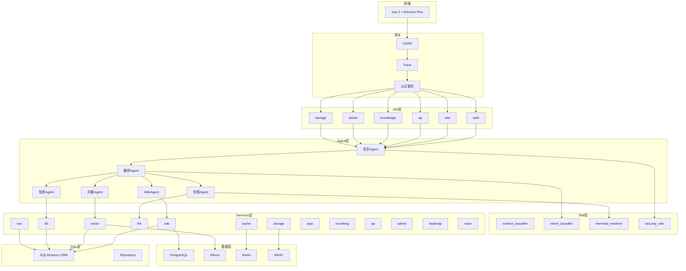
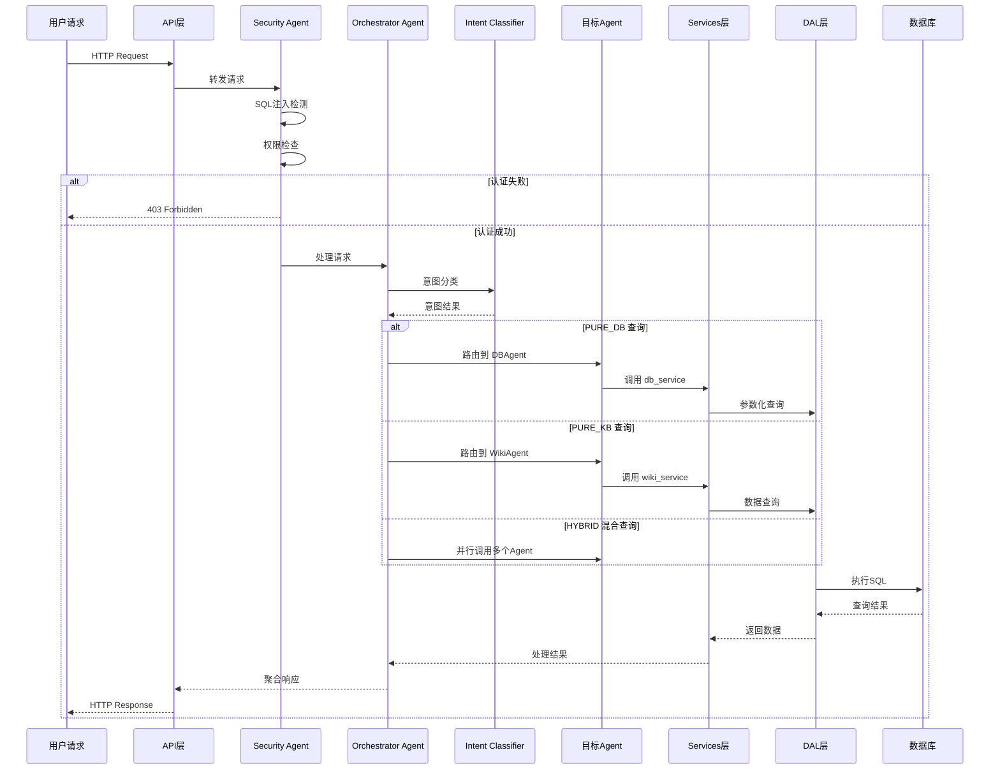
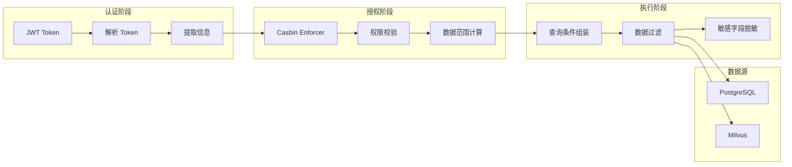
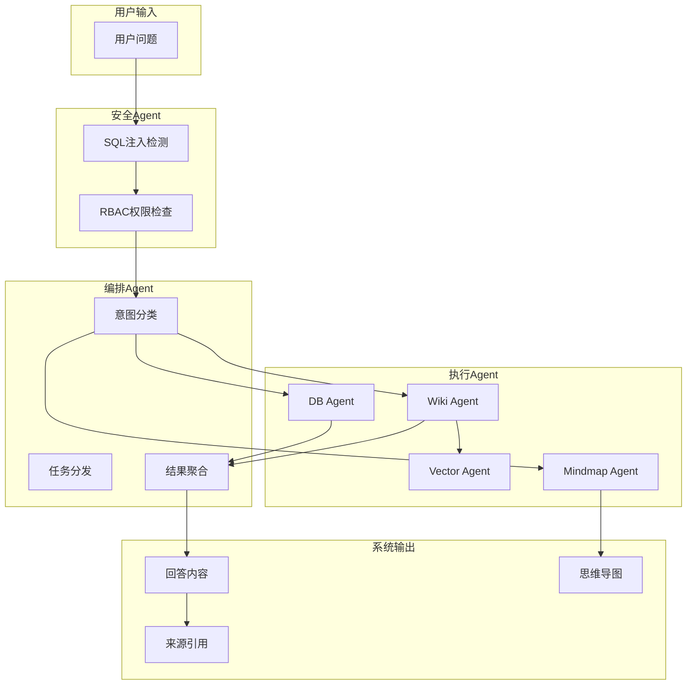

# Knowledge Platform - 后端代码结构图

## 文档信息
- **版本号**: v1.0.0
- **更新时间**: 2026-05-25
- **适用版本**: Knowledge Platform v0.1.0

---

## 一、项目整体架构



---

## 二、目录结构

```
backend/
├── app/                              # 应用主目录
│   ├── main.py                       # FastAPI 入口文件
│   ├── config.py                     # 配置管理（Pydantic Settings）
│   ├── api/                          # API 路由层
│   ├── agents/                       # Agent 实现层
│   ├── services/                     # 业务服务层
│   ├── dal/                          # 数据访问层
│   ├── core/                         # 核心模块
│   ├── models/                       # ORM 模型 + Pydantic Schemas
│   ├── skills/                       # Skill 实现层
│   ├── mcps/                         # MCP 协议层
│   ├── middleware/                   # 中间件
│   └── tasks/                        # 定时任务
├── tests/                            # 测试代码
├── .env.example                      # 环境变量示例
├── pytest.ini                        # pytest 配置
└── requirements.txt                  # 依赖清单
```

---

## 三、模块详细说明

### 3.1 API 层 (`app/api/`)

| 文件 | 功能说明 | 核心方法/端点 |
|------|----------|--------------|
| `auth.py` | 认证路由（Keycloak JWT + 本地用户） | `login`, `logout`, `me`, `setup` |
| `wiki.py` | Wiki 文档 CRUD + 搜索 | `list_pages`, `get_page`, `create_page`, `update_page`, `search` |
| `qa.py` | 智能问答入口 | `query`, `chat`, `feedback` |
| `knowledge.py` | 知识导航管理 | `get_tree`, `create_node`, `update_node`, `delete_node` |
| `admin.py` | 管理后台 | `audit_logs`, `system_config`, `user_management` |
| `system.py` | 系统配置 API | `health`, `settings`, `version` |
| `storage.py` | 对象存储 API | `upload`, `download`, `list`, `delete` |
| `tags.py` | 标签管理 API | `create_tag`, `list_tags`, `update_tag`, `delete_tag` |
| `chunking_rules.py` | 切片规则 API | `list_rules`, `create_rule`, `update_rule` |
| `heatmap.py` | 热力图统计 API | `get_stats`, `get_trends` |
| `trace.py` | 链路追踪 API | `get_traces`, `get_trace_detail` |

### 3.2 Agent 层 (`app/agents/`)

| Agent | 文件 | 功能说明 | 核心能力 |
|-------|------|----------|----------|
| **安全Agent** | `security/agent.py` | SQL注入检测、RBAC鉴权、敏感字段脱敏 | `validate_request`, `check_permission`, `mask_sensitive` |
| **编排Agent** | `orchestrator/agent.py` | 意图识别、任务分解、跨Agent协调、结果聚合 | `classify_intent`, `process_query`, `dispatch_tasks` |
| **Wiki Agent** | `wiki_agent/agent.py` | Wiki文档CRUD、全文检索 | `search`, `get_page`, `create_page`, `update_page` |
| **轻库Agent** | `db_agent/agent.py` | 员工档案查询、行级安全 | `search_employees`, `get_employee`, `list_departments` |
| **向量Agent** | `vector_agent/agent.py` | 向量嵌入、语义搜索 | `create_embedding`, `similarity_search`, `delete_embedding` |
| **思维导图Agent** | `mindmap_agent/agent.py` | 导图生成、知识整合 | `generate_mindmap`, `export_mindmap` |

**编排Agent核心方法说明** (`orchestrator/agent.py`):

| 方法 | 功能 | 参数 | 返回值 |
|------|------|------|--------|
| `classify_intent(query)` | 意图分类 | `query`: 用户查询字符串 | `{"intent": "PURE_DB|PURE_KB|HYBRID", "confidence": 0.0-1.0}` |
| `process_query(query)` | 处理用户查询 | `query`: 用户查询字符串 | `{"answer": str, "sources": list, "confidence": float}` |
| `dispatch_tasks(tasks)` | 分发任务到各个Agent | `tasks`: 任务列表 | `[{"agent_id": str, "success": bool, "data": dict}]` |

### 3.3 服务层 (`app/services/`)

| 服务文件 | 功能说明 | 核心方法 |
|----------|----------|----------|
| `wiki_service.py` | Wiki CRUD + 版本历史 | `list_pages`, `get_page`, `create_page`, `update_page`, `search` |
| `vector_service.py` | Milvus 连接 + 向量操作 | `create_collection`, `insert_embedding`, `search`, `delete` |
| `db_service.py` | 员工档案查询（参数化SQL） | `search_employees`, `get_employee_by_id`, `list_departments` |
| `nav_service.py` | 知识导航树 CRUD | `get_tree`, `create_node`, `update_node`, `delete_node` |
| `llm_service.py` | LLM 调用封装（OpenAI兼容） | `chat_completion`, `embedding`, `classify_intent` |
| `storage_service.py` | 对象存储服务 | `upload_file`, `download_file`, `delete_file`, `list_files` |
| `tags_service.py` | 标签管理服务 | `create_tag`, `list_tags`, `assign_tag`, `remove_tag` |
| `chunking_service.py` | 切片规则服务 | `apply_rules`, `chunk_document`, `get_rules` |
| `qa_service.py` | 智能问答服务 | `query`, `chat`, `get_sources` |
| `admin_service.py` | 管理后台服务 | `get_audit_logs`, `update_config`, `manage_users` |
| `cache_service.py` | Redis缓存服务 | `get`, `set`, `delete`, `expire` |
| `heatmap_service.py` | 热力图统计服务 | `record_event`, `get_stats`, `aggregate` |
| `trace_service.py` | 链路追踪服务 | `start_trace`, `end_trace`, `record_span` |

**WikiService核心方法说明** (`services/wiki_service.py`):

| 方法 | 功能 | 参数 | 返回值 |
|------|------|------|--------|
| `list_pages(user, parent_id, sensitivity, page, page_size)` | 获取Wiki页面列表 | 用户上下文、父节点ID、敏感度、分页参数 | `list[WikiPage]` |
| `get_page(user, page_id)` | 获取页面详情 | 用户上下文、页面ID | `WikiPage \| None` |
| `create_page(user, data)` | 创建页面 | 用户上下文、创建数据 | `WikiPage` |
| `update_page(user, page_id, data)` | 更新页面 | 用户上下文、页面ID、更新数据 | `WikiPage \| None` |
| `delete_page(user, page_id)` | 删除页面 | 用户上下文、页面ID | `bool` |
| `search(user, query, page, page_size)` | 全文搜索 | 用户上下文、查询词、分页参数 | `list[WikiPage]` |

### 3.4 数据访问层 (`app/dal/`)

| 文件 | 功能说明 | 核心方法 |
|------|----------|----------|
| `base.py` | Repository 基类 | `get_by_id`, `create`, `update`, `delete`, `get_all` |
| `postgres.py` | PostgreSQL 适配器 | `connect`, `disconnect`, `execute`, `query` |
| `repositories.py` | 各实体 Repository 实现 | `WikiPageRepository`, `EmployeeRepository`, `ConversationRepository` 等 |
| `registry.py` | Repository 注册表 | `register_repository`, `get_repository` |

### 3.5 核心模块 (`app/core/`)

| 文件 | 功能说明 | 核心方法 |
|------|----------|----------|
| `security.py` | JWT 校验（Keycloak公钥） | `decode_jwt`, `get_current_user`, `hash_password`, `verify_password` |
| `casbin_policy.py` | Casbin RBAC 策略引擎 | `init_policies`, `check_permission`, `add_policy`, `remove_policy` |
| `middleware.py` | 审计日志中间件 | `audit_log_middleware`, `log_request`, `log_response` |
| `logging.py` | 日志配置 | `setup_logging`, `get_logger` |
| `trace.py` | 链路追踪日志 | `setup_trace_logging`, `trace_context` |
| `redis.py` | Redis 连接管理 | `get_redis`, `close_redis` |
| `encryption.py` | 敏感配置加密 | `encrypt`, `decrypt` |
| `events.py` | 事件发布订阅 | `publish`, `subscribe`, `unsubscribe` |

### 3.6 模型层 (`app/models/`)

| 文件 | 功能说明 | 核心模型 |
|------|----------|----------|
| `wiki.py` | Wiki 相关 ORM 模型 | `WikiPage`, `WikiPageVersion`, `WikiFile`, `WikiChunk` |
| `wiki_storage.py` | Wiki 存储扩展模型 | `WikiTag`, `WikiPageTag`, `ChunkingRule` |
| `employee.py` | 员工档案模型 | `Employee` |
| `conversation.py` | 会话问答模型 | `Conversation` |
| `navigation.py` | 知识导航模型 | `KnowledgeNav`, `NavContentLink` |
| `audit.py` | 审计日志模型 | `AuditLog`, `SearchEvent` |
| `casbin.py` | Casbin 策略模型 | `CasbinRule` |
| `local_user.py` | 本地用户模型 | `LocalUser` |
| `heatmap.py` | 热力图模型 | `HeatmapStat`, `TraceSession`, `TraceSpan` |
| `system_config.py` | 系统配置模型 | `SystemConfig` |
| `schemas.py` | Pydantic 数据传输模型 | `UserContext`, `WikiPageCreate`, `WikiPageResponse` 等 |

### 3.7 Skill 层 (`app/skills/`)

| Skill | 文件 | 功能说明 | 核心方法 |
|-------|------|----------|----------|
| `content_classifier` | `content_classifier/skill.py` | 内容分类、标签提取、语义聚类 | `classify_content`, `extract_tags`, `cluster` |
| `intent_classifier` | `intent_classifier/skill.py` | 意图识别 | `classify`, `score_intents` |
| `mermaid_renderer` | `mermaid_renderer/skill.py` | Mermaid语法生成与渲染 | `generate_mermaid`, `render_svg` |
| `security_utils` | `security_utils/skill.py` | SQL注入检测、敏感词检测、脱敏 | `detect_sql_injection`, `detect_sensitive_words`, `mask_fields` |

### 3.8 MCP 协议层 (`app/mcps/`)

| 文件 | 功能说明 | 核心方法 |
|------|----------|----------|
| `unified_client.py` | 统一 MCP 客户端 | `call`, `list_agents`, `get_agent_info` |
| `external_client.py` | 外部 MCP Server 客户端 | `connect`, `call`, `disconnect` |
| `mcp_protocol/protocol.py` | MCP 协议定义 | `MCPRequest`, `MCPResponse`, `AgentCapability` |
| `registry/service.py` | Agent 注册表服务 | `register`, `get`, `list`, `unregister` |

### 3.9 定时任务 (`app/tasks/`)

| 文件 | 功能说明 | 核心方法 |
|------|----------|----------|
| `heatmap_aggregator.py` | 热力图统计聚合器 | `start_scheduler`, `stop_scheduler`, `aggregate_hourly` |

---

## 四、数据流

### 4.1 请求处理流程



### 4.2 权限数据流



### 4.3 Agent 协作流程



---

## 五、核心入口文件

### 5.1 `main.py` - FastAPI 入口

| 核心功能 | 说明 |
|----------|------|
| `lifespan` | 应用生命周期管理，初始化数据库、Casbin策略、Agent、Skill |
| `init_agents()` | 注册所有内置Agent |
| `ensure_default_admin()` | 确保默认管理员用户存在 |
| 路由注册 | 注册所有API路由（auth, wiki, qa, knowledge, admin等） |

### 5.2 `config.py` - 配置管理

| 配置类别 | 关键字段 |
|----------|----------|
| 应用配置 | `APP_NAME`, `APP_VERSION`, `DEBUG` |
| 数据库 | `DATABASE_URL` |
| Redis | `REDIS_URL`, `REDIS_HOST`, `REDIS_PORT` |
| Milvus | `MILVUS_HOST`, `MILVUS_PORT`, `MILVUS_COLLECTION` |
| Keycloak | `KEYCLOAK_SERVER_URL`, `KEYCLOAK_REALM`, `KEYCLOAK_CLIENT_ID` |
| LLM | `LLM_PROVIDER`, `LLM_API_BASE`, `LLM_MODEL`, `LLM_EMBEDDING_MODEL` |
| 安全 | `CORS_ORIGINS`, `ENCRYPTION_KEY` |

---

## 六、技术栈

| 类别 | 技术 | 版本 |
|------|------|------|
| 框架 | FastAPI | ^0.100.0 |
| ORM | SQLAlchemy | ^2.0 |
| 数据库 | PostgreSQL | 15+ |
| 向量库 | Milvus | 2.4+ |
| 缓存 | Redis | 7+ |
| 认证 | Keycloak | 24+ |
| 权限 | Casbin | ^1.2.0 |
| 异步 | asyncpg | ^0.27.0 |
| LLM | OpenAI/DeepSeek/Zhipu/Ollama | - |

---

## 七、关键约束

1. **SQL安全**: 所有SQL必须使用参数化查询（SQLAlchemy ORM），禁止字符串拼接
2. **权限检查**: 每个数据访问必须经过Casbin RBAC权限校验
3. **敏感字段脱敏**: 根据用户角色对敏感字段（salary, phone）进行脱敏处理
4. **来源引用**: 所有回答必须引用来源
5. **审计日志**: 所有API操作记录到audit_logs表
6. **分层调用**: API → Services → DAL，禁止跨层调用
7. **Agent调用**: Agent调用Skill必须使用统一的Skill执行器

---

## 八、版本历史

| 版本 | 更新时间 | 更新内容 |
|------|----------|----------|
| v1.0.0 | 2026-05-25 | 初始版本，包含完整后端代码结构 |
