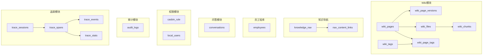

# Knowledge Platform - 数据库结构文档

## 文档信息
- **版本号**: v1.0.0
- **更新时间**: 2026-05-25
- **适用版本**: Knowledge Platform v0.1.0
- **数据库**: PostgreSQL 15+

---

## 一、数据库概述

本项目使用 PostgreSQL 15+ 作为主要关系型数据库，配合以下扩展：
- **uuid-ossp**: 生成 UUID
- **ltree**: 树形数据结构支持（知识导航树）

---

## 二、表结构总览

| 表名 | 功能说明 | 所属模块 |
|------|----------|----------|
| `wiki_pages` | Wiki 页面元数据 | Wiki |
| `wiki_page_versions` | Wiki 版本历史 | Wiki |
| `wiki_files` | Wiki 文件存储记录 | Wiki |
| `wiki_chunks` | 文档切片记录 | Wiki |
| `wiki_tags` | 标签定义 | Wiki |
| `wiki_page_tags` | 页面与标签关联 | Wiki |
| `chunking_rules` | 切片规则定义 | Wiki |
| `employees` | 员工档案 | 轻库 |
| `conversations` | 会话问答记录 | QA |
| `knowledge_nav` | 知识导航树 | 知识导航 |
| `nav_content_links` | 导航节点与内容关联 | 知识导航 |
| `casbin_rule` | Casbin 策略持久化 | 权限 |
| `audit_logs` | 操作审计日志 | 审计 |
| `local_users` | 本地用户表 | 认证 |
| `system_config` | 系统配置 | 系统 |
| `search_events` | 搜索事件记录 | 搜索 |
| `heatmap_stats` | 热力图统计 | 热力图 |
| `trace_sessions` | 链路追踪会话 | 追踪 |
| `trace_spans` | 链路追踪 Span | 追踪 |
| `trace_events` | 链路追踪事件 | 追踪 |
| `trace_stats` | 链路追踪统计 | 追踪 |

---

## 三、表结构详细说明

### 3.1 Wiki 相关表

#### 3.1.1 wiki_pages（Wiki 页面表）

| 字段名 | 类型 | 长度 | 约束 | 说明 |
|--------|------|------|------|------|
| `id` | UUID | - | PRIMARY KEY, DEFAULT uuid_generate_v4() | 页面唯一标识 |
| `title` | VARCHAR | 500 | NOT NULL | 页面标题 |
| `content` | TEXT | - | NOT NULL | 页面内容 |
| `slug` | VARCHAR | 500 | UNIQUE, NOT NULL | 页面路径别名 |
| `parent_id` | UUID | - | REFERENCES wiki_pages(id) | 父页面ID（层级结构） |
| `acl` | JSONB | - | DEFAULT '{}' | 访问控制列表 |
| `sensitivity` | VARCHAR | 20 | DEFAULT 'public' | 敏感度分级（public/internal/confidential/secret） |
| `dept_id` | VARCHAR | 50 | - | 部门ID（数据隔离） |
| `created_by` | VARCHAR | 100 | NOT NULL | 创建人 |
| `updated_by` | VARCHAR | 100 | - | 更新人 |
| `created_at` | TIMESTAMP | - | DEFAULT CURRENT_TIMESTAMP | 创建时间 |
| `updated_at` | TIMESTAMP | - | DEFAULT CURRENT_TIMESTAMP | 更新时间 |
| `processing_status` | VARCHAR | 20 | DEFAULT 'pending' | 处理状态（pending/processing/completed/failed） |
| `processing_error` | TEXT | - | - | 处理错误信息 |

**索引**:
| 索引名 | 字段 | 类型 |
|--------|------|------|
| `idx_wiki_pages_slug` | slug | 普通索引 |
| `idx_wiki_pages_parent_id` | parent_id | 普通索引 |
| `idx_wiki_pages_sensitivity` | sensitivity | 普通索引 |
| `idx_wiki_pages_dept_id` | dept_id | 普通索引 |
| `idx_wiki_pages_status` | processing_status | 普通索引 |

#### 3.1.2 wiki_page_versions（Wiki 版本历史表）

| 字段名 | 类型 | 长度 | 约束 | 说明 |
|--------|------|------|------|------|
| `id` | UUID | - | PRIMARY KEY, DEFAULT uuid_generate_v4() | 版本唯一标识 |
| `page_id` | UUID | - | NOT NULL, REFERENCES wiki_pages(id) ON DELETE CASCADE | 关联页面ID |
| `title` | VARCHAR | 500 | NOT NULL | 版本标题 |
| `content` | TEXT | - | NOT NULL | 版本内容 |
| `version` | INTEGER | - | NOT NULL | 版本号 |
| `edited_by` | VARCHAR | 100 | NOT NULL | 编辑人 |
| `edit_summary` | VARCHAR | 500 | - | 编辑摘要 |
| `created_at` | TIMESTAMP | - | DEFAULT CURRENT_TIMESTAMP | 创建时间 |

**索引**:
| 索引名 | 字段 | 类型 |
|--------|------|------|
| `idx_wiki_versions_page_id` | page_id | 普通索引 |
| `idx_wiki_versions_page_version` | page_id, version | 复合索引 |

#### 3.1.3 wiki_files（Wiki 文件表）

| 字段名 | 类型 | 长度 | 约束 | 说明 |
|--------|------|------|------|------|
| `id` | UUID | - | PRIMARY KEY, DEFAULT gen_random_uuid() | 文件唯一标识 |
| `page_id` | UUID | - | NOT NULL, REFERENCES wiki_pages(id) ON DELETE CASCADE | 关联页面ID |
| `version` | INTEGER | - | NOT NULL | 文件版本 |
| `file_path` | VARCHAR | 500 | NOT NULL | 文件存储路径 |
| `file_name` | VARCHAR | 200 | NOT NULL | 文件名 |
| `file_size` | INTEGER | - | NOT NULL | 文件大小（字节） |
| `md5_hash` | VARCHAR | 32 | NOT NULL | 文件MD5校验值 |
| `mime_type` | VARCHAR | 100 | DEFAULT 'text/markdown' | MIME类型 |
| `is_current` | BOOLEAN | - | DEFAULT true | 是否当前版本 |
| `created_by` | VARCHAR | 100 | NOT NULL | 创建人 |
| `created_at` | TIMESTAMP | - | DEFAULT NOW() | 创建时间 |
| `edit_summary` | VARCHAR | 500 | - | 编辑摘要 |

**索引**:
| 索引名 | 字段 | 类型 |
|--------|------|------|
| `idx_wiki_files_page` | page_id | 普通索引 |
| `idx_wiki_files_current` | page_id, is_current (WHERE is_current=true) | 部分索引 |
| `idx_wiki_files_version` | page_id, version | 唯一索引 |

#### 3.1.4 wiki_chunks（Wiki 文档切片表）

| 字段名 | 类型 | 长度 | 约束 | 说明 |
|--------|------|------|------|------|
| `id` | UUID | - | PRIMARY KEY, DEFAULT gen_random_uuid() | 切片唯一标识 |
| `file_id` | UUID | - | NOT NULL, REFERENCES wiki_files(id) ON DELETE CASCADE | 关联文件ID |
| `chunk_index` | INTEGER | - | NOT NULL | 切片序号 |
| `start_pos` | INTEGER | - | NOT NULL | 起始位置 |
| `end_pos` | INTEGER | - | NOT NULL | 结束位置 |
| `text_preview` | VARCHAR | 200 | - | 文本预览 |
| `vector_id` | VARCHAR | 100 | NOT NULL | 向量ID（关联Milvus） |

**索引**:
| 索引名 | 字段 | 类型 |
|--------|------|------|
| `idx_wiki_chunks_file` | file_id | 普通索引 |
| `idx_wiki_chunks_vector` | vector_id | 普通索引 |

#### 3.1.5 wiki_tags（Wiki 标签表）

| 字段名 | 类型 | 长度 | 约束 | 说明 |
|--------|------|------|------|------|
| `id` | UUID | - | PRIMARY KEY, DEFAULT gen_random_uuid() | 标签唯一标识 |
| `name` | VARCHAR | 100 | UNIQUE, NOT NULL | 标签名称 |
| `color` | VARCHAR | 20 | DEFAULT '#3B82F6' | 标签颜色 |
| `description` | TEXT | - | - | 标签描述 |
| `parent_id` | UUID | - | REFERENCES wiki_tags(id) | 父标签ID（层级标签） |
| `sort_order` | INTEGER | - | DEFAULT 0 | 排序顺序 |
| `created_by` | VARCHAR | 100 | NOT NULL | 创建人 |
| `created_at` | TIMESTAMP | - | DEFAULT NOW() | 创建时间 |

**索引**:
| 索引名 | 字段 | 类型 |
|--------|------|------|
| `idx_wiki_tags_parent` | parent_id | 普通索引 |
| `idx_wiki_tags_sort` | sort_order | 普通索引 |

#### 3.1.6 wiki_page_tags（Wiki 页面标签关联表）

| 字段名 | 类型 | 长度 | 约束 | 说明 |
|--------|------|------|------|------|
| `page_id` | UUID | - | NOT NULL, REFERENCES wiki_pages(id) ON DELETE CASCADE | 页面ID |
| `tag_id` | UUID | - | NOT NULL, REFERENCES wiki_tags(id) ON DELETE CASCADE | 标签ID |

**约束**: PRIMARY KEY (page_id, tag_id)

**索引**:
| 索引名 | 字段 | 类型 |
|--------|------|------|
| `idx_wiki_page_tags_page` | page_id | 普通索引 |
| `idx_wiki_page_tags_tag` | tag_id | 普通索引 |

#### 3.1.7 chunking_rules（切片规则表）

| 字段名 | 类型 | 长度 | 约束 | 说明 |
|--------|------|------|------|------|
| `id` | UUID | - | PRIMARY KEY, DEFAULT gen_random_uuid() | 规则唯一标识 |
| `name` | VARCHAR | 100 | NOT NULL | 规则名称 |
| `description` | TEXT | - | - | 规则描述 |
| `rule_type` | VARCHAR | 20 | NOT NULL | 规则类型（heading/paragraph/length/custom） |
| `rule_config` | JSONB | - | NOT NULL | 规则配置 |
| `is_active` | BOOLEAN | - | DEFAULT true | 是否启用 |
| `sort_order` | INTEGER | - | DEFAULT 0 | 排序顺序 |
| `created_at` | TIMESTAMP | - | DEFAULT NOW() | 创建时间 |
| `updated_at` | TIMESTAMP | - | DEFAULT NOW() | 更新时间 |

**索引**:
| 索引名 | 字段 | 类型 |
|--------|------|------|
| `idx_chunking_rules_active` | is_active (WHERE is_active=true) | 部分索引 |
| `idx_chunking_rules_sort` | sort_order | 普通索引 |

---

### 3.2 员工档案表

#### 3.2.1 employees（员工档案表）

| 字段名 | 类型 | 长度 | 约束 | 说明 |
|--------|------|------|------|------|
| `employee_id` | VARCHAR | 50 | PRIMARY KEY | 员工ID |
| `name` | VARCHAR | 100 | NOT NULL | 员工姓名 |
| `department` | VARCHAR | 100 | - | 部门名称 |
| `level` | VARCHAR | 20 | - | 职级 |
| `hire_date` | DATE | - | - | 入职日期 |
| `manager_id` | VARCHAR | 50 | REFERENCES employees(employee_id) | 上级经理ID |
| `email` | VARCHAR | 200 | - | 邮箱 |
| `phone` | VARCHAR | 50 | - | 电话（敏感字段） |
| `status` | VARCHAR | 20 | DEFAULT 'active' | 状态（active/inactive） |
| `clearance_level` | INTEGER | - | DEFAULT 1 | 保密级别 |
| `dept_id` | VARCHAR | 50 | - | 部门ID |
| `salary` | NUMERIC | 12,2 | - | 薪资（敏感字段） |
| `created_at` | TIMESTAMP | - | DEFAULT CURRENT_TIMESTAMP | 创建时间 |
| `updated_at` | TIMESTAMP | - | DEFAULT CURRENT_TIMESTAMP | 更新时间 |

**索引**:
| 索引名 | 字段 | 类型 |
|--------|------|------|
| `idx_employees_department` | department | 普通索引 |
| `idx_employees_dept_id` | dept_id | 普通索引 |
| `idx_employees_manager_id` | manager_id | 普通索引 |

---

### 3.3 会话问答表

#### 3.3.1 conversations（会话问答记录表）

| 字段名 | 类型 | 长度 | 约束 | 说明 |
|--------|------|------|------|------|
| `id` | UUID | - | PRIMARY KEY, DEFAULT uuid_generate_v4() | 会话唯一标识 |
| `user_id` | VARCHAR | 100 | NOT NULL | 用户ID |
| `dept_id` | VARCHAR | 50 | - | 部门ID |
| `question` | TEXT | - | NOT NULL | 用户问题 |
| `answer` | TEXT | - | NOT NULL | AI回答 |
| `source_refs` | JSONB | - | DEFAULT '[]' | 来源引用列表 |
| `embedding_id` | VARCHAR | 100 | - | 向量ID |
| `sensitivity` | VARCHAR | 20 | DEFAULT 'public' | 敏感度 |
| `feedback` | INTEGER | - | - | 用户反馈（1=好评，-1=差评） |
| `created_at` | TIMESTAMP | - | DEFAULT CURRENT_TIMESTAMP | 创建时间 |

**索引**:
| 索引名 | 字段 | 类型 |
|--------|------|------|
| `idx_conversations_user_id` | user_id | 普通索引 |
| `idx_conversations_dept_id` | dept_id | 普通索引 |
| `idx_conversations_created_at` | created_at | 普通索引 |

---

### 3.4 知识导航表

#### 3.4.1 knowledge_nav（知识导航树表）

| 字段名 | 类型 | 长度 | 约束 | 说明 |
|--------|------|------|------|------|
| `id` | UUID | - | PRIMARY KEY, DEFAULT uuid_generate_v4() | 节点唯一标识 |
| `name` | VARCHAR | 200 | NOT NULL | 节点名称 |
| `parent_id` | UUID | - | REFERENCES knowledge_nav(id) ON DELETE CASCADE | 父节点ID |
| `path` | VARCHAR | 500 | - | ltree 物化路径 |
| `icon` | VARCHAR | 50 | - | 图标名称 |
| `description` | TEXT | - | - | 节点描述 |
| `sort_order` | INTEGER | - | DEFAULT 0 | 排序顺序 |
| `visibility_roles` | TEXT[] | - | - | 可见角色列表 |
| `created_by` | VARCHAR | 100 | - | 创建人 |
| `created_at` | TIMESTAMP | - | DEFAULT CURRENT_TIMESTAMP | 创建时间 |
| `updated_at` | TIMESTAMP | - | DEFAULT CURRENT_TIMESTAMP | 更新时间 |

**索引**:
| 索引名 | 字段 | 类型 |
|--------|------|------|
| `idx_knowledge_nav_parent_id` | parent_id | 普通索引 |
| `idx_knowledge_nav_path` | path | 普通索引 |

#### 3.4.2 nav_content_links（导航节点内容关联表）

| 字段名 | 类型 | 长度 | 约束 | 说明 |
|--------|------|------|------|------|
| `id` | UUID | - | PRIMARY KEY, DEFAULT uuid_generate_v4() | 关联唯一标识 |
| `nav_id` | UUID | - | NOT NULL, REFERENCES knowledge_nav(id) ON DELETE CASCADE | 导航节点ID |
| `content_type` | VARCHAR | 20 | NOT NULL | 内容类型（wiki/page/link等） |
| `content_id` | VARCHAR | 100 | NOT NULL | 内容ID |
| `created_at` | TIMESTAMP | - | DEFAULT CURRENT_TIMESTAMP | 创建时间 |

**索引**:
| 索引名 | 字段 | 类型 |
|--------|------|------|
| `idx_nav_content_links_nav_id` | nav_id | 普通索引 |
| `idx_nav_content_links_content` | content_type, content_id | 复合索引 |

---

### 3.5 权限与认证表

#### 3.5.1 casbin_rule（Casbin 策略表）

| 字段名 | 类型 | 长度 | 约束 | 说明 |
|--------|------|------|------|------|
| `id` | INTEGER | - | PRIMARY KEY AUTOINCREMENT | 策略唯一标识 |
| `ptype` | VARCHAR | 100 | NOT NULL | 策略类型（p=策略, g=角色组） |
| `v0` | VARCHAR | 100 | - | 角色/用户 |
| `v1` | VARCHAR | 100 | - | 资源 |
| `v2` | VARCHAR | 100 | - | 动作 |
| `v3` | VARCHAR | 100 | - | 额外参数 |
| `v4` | VARCHAR | 100 | - | 额外参数 |
| `v5` | VARCHAR | 100 | - | 额外参数 |

#### 3.5.2 local_users（本地用户表）

| 字段名 | 类型 | 长度 | 约束 | 说明 |
|--------|------|------|------|------|
| `id` | INTEGER | - | PRIMARY KEY AUTOINCREMENT | 用户唯一标识 |
| `username` | VARCHAR | 100 | UNIQUE, NOT NULL | 用户名 |
| `password_hash` | VARCHAR | 200 | NOT NULL | 密码哈希 |
| `email` | VARCHAR | 200 | DEFAULT '' | 邮箱 |
| `roles` | TEXT[] | - | DEFAULT '{}' | 角色列表 |
| `dept_id` | VARCHAR | 50 | - | 部门ID |
| `is_active` | BOOLEAN | - | DEFAULT TRUE | 是否启用 |
| `created_at` | TIMESTAMP | - | DEFAULT CURRENT_TIMESTAMP | 创建时间 |
| `updated_at` | TIMESTAMP | - | DEFAULT CURRENT_TIMESTAMP | 更新时间 |

**索引**:
| 索引名 | 字段 | 类型 |
|--------|------|------|
| `idx_local_users_username` | username | 普通索引 |
| `idx_local_users_dept_id` | dept_id | 普通索引 |

---

### 3.6 审计日志表

#### 3.6.1 audit_logs（审计日志表）

| 字段名 | 类型 | 长度 | 约束 | 说明 |
|--------|------|------|------|------|
| `id` | BIGINT | - | PRIMARY KEY AUTOINCREMENT | 日志唯一标识 |
| `user_id` | VARCHAR | 100 | NOT NULL | 用户ID |
| `user_roles` | TEXT[] | - | - | 用户角色列表 |
| `action` | VARCHAR | 50 | NOT NULL | 操作类型 |
| `resource_type` | VARCHAR | 50 | - | 资源类型 |
| `resource_id` | VARCHAR | 100 | - | 资源ID |
| `details` | JSONB | - | - | 操作详情 |
| `ip_address` | VARCHAR | 45 | - | IP地址 |
| `user_agent` | TEXT | - | - | 用户代理 |
| `status_code` | INTEGER | - | - | HTTP状态码 |
| `created_at` | TIMESTAMP | - | DEFAULT CURRENT_TIMESTAMP | 创建时间 |

**索引**:
| 索引名 | 字段 | 类型 |
|--------|------|------|
| `idx_audit_logs_user_id` | user_id | 普通索引 |
| `idx_audit_logs_action` | action | 普通索引 |
| `idx_audit_logs_created_at` | created_at | 普通索引 |

---

### 3.7 系统配置表

#### 3.7.1 system_config（系统配置表）

| 字段名 | 类型 | 长度 | 约束 | 说明 |
|--------|------|------|------|------|
| `id` | INTEGER | - | PRIMARY KEY AUTOINCREMENT | 配置唯一标识 |
| `category` | VARCHAR | 50 | NOT NULL | 配置类别 |
| `key` | VARCHAR | 200 | NOT NULL | 配置键 |
| `value` | TEXT | - | - | 配置值 |
| `value_type` | VARCHAR | 20 | DEFAULT 'string' | 值类型 |
| `description` | VARCHAR | 500 | - | 配置说明 |
| `is_sensitive` | BOOLEAN | - | DEFAULT FALSE | 是否敏感（加密存储） |
| `created_at` | TIMESTAMP | - | DEFAULT CURRENT_TIMESTAMP | 创建时间 |
| `updated_at` | TIMESTAMP | - | DEFAULT CURRENT_TIMESTAMP | 更新时间 |

**索引**:
| 索引名 | 字段 | 类型 |
|--------|------|------|
| `idx_system_config_category_key` | category, key | 唯一索引 |

---

### 3.8 搜索与热力图表

#### 3.8.1 search_events（搜索事件表）

| 字段名 | 类型 | 长度 | 约束 | 说明 |
|--------|------|------|------|------|
| `id` | INTEGER | - | PRIMARY KEY AUTOINCREMENT | 事件唯一标识 |
| `query_text` | VARCHAR | 500 | NOT NULL | 查询文本 |
| `query_embedding` | TEXT | - | - | 查询向量 |
| `user_id` | VARCHAR | 128 | - | 用户ID |
| `dept_id` | VARCHAR | 64 | - | 部门ID |
| `hit_doc_ids` | TEXT[] | - | - | 命中文档ID列表 |
| `hit_scores` | FLOAT[] | - | - | 命中分数列表 |
| `filter_conditions` | JSONB | - | - | 过滤条件 |
| `search_duration_ms` | INTEGER | - | - | 搜索耗时（毫秒） |
| `created_at` | TIMESTAMP | - | DEFAULT CURRENT_TIMESTAMP | 创建时间 |

**索引**:
| 索引名 | 字段 | 类型 |
|--------|------|------|
| `idx_search_events_created_at` | created_at | 普通索引 |
| `idx_search_events_user_id` | user_id | 普通索引 |

#### 3.8.2 heatmap_stats（热力图统计表）

| 字段名 | 类型 | 长度 | 约束 | 说明 |
|--------|------|------|------|------|
| `id` | INTEGER | - | PRIMARY KEY AUTOINCREMENT | 统计唯一标识 |
| `stat_type` | VARCHAR | 20 | NOT NULL | 统计类型 |
| `stat_key` | VARCHAR | 500 | NOT NULL | 统计键 |
| `stat_date` | DATE | - | NOT NULL | 统计日期 |
| `count` | INTEGER | - | DEFAULT 0 | 计数 |
| `unique_users` | INTEGER | - | DEFAULT 0 | 独立用户数 |
| `avg_duration_ms` | FLOAT | - | - | 平均耗时（毫秒） |
| `updated_at` | TIMESTAMP | - | DEFAULT CURRENT_TIMESTAMP | 更新时间 |

**索引**:
| 索引名 | 字段 | 类型 |
|--------|------|------|
| `idx_heatmap_stats_type_date` | stat_type, stat_date | 复合索引 |
| `idx_heatmap_stats_unique` | stat_type, stat_key, stat_date | 唯一索引 |

---

### 3.9 链路追踪表

#### 3.9.1 trace_sessions（链路追踪会话表）

| 字段名 | 类型 | 长度 | 约束 | 说明 |
|--------|------|------|------|------|
| `id` | VARCHAR | 64 | PRIMARY KEY | 会话唯一标识 |
| `trace_id` | VARCHAR | 32 | NOT NULL, UNIQUE | 追踪ID |
| `request_id` | VARCHAR | 32 | NOT NULL | 请求ID |
| `user_id` | VARCHAR | 64 | NOT NULL | 用户ID |
| `username` | VARCHAR | 128 | - | 用户名 |
| `endpoint` | VARCHAR | 256 | - | 请求端点 |
| `method` | VARCHAR | 16 | - | HTTP方法 |
| `question` | TEXT | - | - | 用户问题 |
| `intent` | VARCHAR | 32 | - | 意图分类 |
| `status` | VARCHAR | 16 | DEFAULT 'running' | 状态（running/success/failed） |
| `total_spans` | INTEGER | - | DEFAULT 0 | Span总数 |
| `total_events` | INTEGER | - | DEFAULT 0 | 事件总数 |
| `success_count` | INTEGER | - | DEFAULT 0 | 成功数 |
| `error_count` | INTEGER | - | DEFAULT 0 | 错误数 |
| `start_time` | TIMESTAMP | - | DEFAULT CURRENT_TIMESTAMP | 开始时间 |
| `end_time` | TIMESTAMP | - | - | 结束时间 |
| `duration_ms` | FLOAT | - | - | 耗时（毫秒） |
| `result_summary` | TEXT | - | - | 结果摘要 |
| `output_preview` | TEXT | - | - | 输出预览 |
| `created_at` | TIMESTAMP | - | DEFAULT CURRENT_TIMESTAMP | 创建时间 |
| `updated_at` | TIMESTAMP | - | DEFAULT CURRENT_TIMESTAMP | 更新时间 |

**索引**:
| 索引名 | 字段 | 类型 |
|--------|------|------|
| `idx_trace_user_time` | user_id, start_time | 复合索引 |
| `idx_trace_status_time` | status, start_time | 复合索引 |

#### 3.9.2 trace_spans（链路追踪Span表）

| 字段名 | 类型 | 长度 | 约束 | 说明 |
|--------|------|------|------|------|
| `id` | VARCHAR | 64 | PRIMARY KEY | Span唯一标识 |
| `trace_id` | VARCHAR | 32 | NOT NULL | 追踪ID |
| `span_id` | VARCHAR | 32 | NOT NULL | Span ID |
| `parent_span_id` | VARCHAR | 32 | - | 父Span ID |
| `session_id` | VARCHAR | 64 | NOT NULL | 会话ID |
| `agent_id` | VARCHAR | 64 | NOT NULL | Agent ID |
| `agent_name` | VARCHAR | 128 | - | Agent名称 |
| `action` | VARCHAR | 64 | - | 动作 |
| `input_summary` | JSON | - | - | 输入摘要 |
| `output_summary` | JSON | - | - | 输出摘要 |
| `status` | VARCHAR | 16 | DEFAULT 'running' | 状态 |
| `error_message` | TEXT | - | - | 错误信息 |
| `start_time` | TIMESTAMP | - | DEFAULT CURRENT_TIMESTAMP | 开始时间 |
| `end_time` | TIMESTAMP | - | - | 结束时间 |
| `duration_ms` | FLOAT | - | - | 耗时（毫秒） |
| `confidence` | FLOAT | - | - | 置信度 |
| `sources_count` | INTEGER | - | DEFAULT 0 | 来源数量 |
| `created_at` | TIMESTAMP | - | DEFAULT CURRENT_TIMESTAMP | 创建时间 |

**约束**:
- `fk_span_session`: FOREIGN KEY (session_id) REFERENCES trace_sessions(id) ON DELETE CASCADE
- `fk_span_parent`: FOREIGN KEY (parent_span_id) REFERENCES trace_spans(span_id) ON DELETE SET NULL

**索引**:
| 索引名 | 字段 | 类型 |
|--------|------|------|
| `idx_span_trace_id` | trace_id | 普通索引 |
| `idx_span_session_agent` | session_id, agent_id | 复合索引 |

#### 3.9.3 trace_events（链路追踪事件表）

| 字段名 | 类型 | 长度 | 约束 | 说明 |
|--------|------|------|------|------|
| `id` | VARCHAR | 64 | PRIMARY KEY | 事件唯一标识 |
| `trace_id` | VARCHAR | 32 | NOT NULL | 追踪ID |
| `span_id` | VARCHAR | 32 | NOT NULL | Span ID |
| `event_type` | VARCHAR | 32 | NOT NULL | 事件类型 |
| `event_name` | VARCHAR | 128 | - | 事件名称 |
| `data` | JSON | - | - | 事件数据 |
| `message` | TEXT | - | - | 事件消息 |
| `timestamp` | TIMESTAMP | - | DEFAULT CURRENT_TIMESTAMP | 时间戳 |

**约束**:
- `fk_event_span`: FOREIGN KEY (span_id) REFERENCES trace_spans(span_id) ON DELETE CASCADE

**索引**:
| 索引名 | 字段 | 类型 |
|--------|------|------|
| `idx_event_trace_id` | trace_id | 普通索引 |

#### 3.9.4 trace_stats（链路追踪统计表）

| 字段名 | 类型 | 长度 | 约束 | 说明 |
|--------|------|------|------|------|
| `id` | VARCHAR | 64 | PRIMARY KEY | 统计唯一标识 |
| `user_id` | VARCHAR | 64 | NOT NULL | 用户ID |
| `stat_date` | TIMESTAMP | - | NOT NULL | 统计日期 |
| `total_requests` | INTEGER | - | DEFAULT 0 | 总请求数 |
| `success_requests` | INTEGER | - | DEFAULT 0 | 成功请求数 |
| `failed_requests` | INTEGER | - | DEFAULT 0 | 失败请求数 |
| `total_duration_ms` | FLOAT | - | DEFAULT 0 | 总耗时（毫秒） |
| `avg_duration_ms` | FLOAT | - | DEFAULT 0 | 平均耗时（毫秒） |
| `p95_duration_ms` | FLOAT | - | DEFAULT 0 | P95耗时（毫秒） |
| `agent_usage` | JSON | - | - | Agent使用统计 |
| `intent_distribution` | JSON | - | - | 意图分布 |
| `error_types` | JSON | - | - | 错误类型分布 |
| `created_at` | TIMESTAMP | - | DEFAULT CURRENT_TIMESTAMP | 创建时间 |
| `updated_at` | TIMESTAMP | - | DEFAULT CURRENT_TIMESTAMP | 更新时间 |

**索引**:
| 索引名 | 字段 | 类型 |
|--------|------|------|
| `idx_stats_user_date` | user_id, stat_date | 复合索引 |

---

## 四、数据库关系图

```mermaid
erDiagram
    wiki_pages ||--o{ wiki_page_versions : "版本历史"
    wiki_pages ||--o{ wiki_files : "文件存储"
    wiki_pages ||--o{ wiki_page_tags : "标签关联"
    wiki_files ||--o{ wiki_chunks : "文档切片"

    wiki_tags ||--o{ wiki_page_tags : "页面标签"
    wiki_tags ||--o| wiki_tags : "父级标签"

    knowledge_nav ||--o{ nav_content_links : "内容关联"
    knowledge_nav ||--o| knowledge_nav : "父子导航"

    employees ||--o| employees : "上下级关系"

    trace_sessions ||--o{ trace_spans : "追踪Span"
    trace_spans ||--o{ trace_events : "追踪事件"
    trace_spans ||--o| trace_spans : "父子Span"
    trace_sessions ||--o| trace_stats : "统计汇总"

    wiki_pages {
        uuid id PK
        varchar title
        text content
        varchar slug UK
        uuid parent_id FK
        varchar sensitivity
        varchar dept_id
        varchar created_by
        timestamp created_at
    }

    wiki_page_versions {
        uuid id PK
        uuid page_id FK
        varchar title
        text content
        int version
        varchar edited_by
        timestamp created_at
    }

    wiki_files {
        uuid id PK
        uuid page_id FK
        int version
        varchar file_path
        varchar file_name
        int file_size
        varchar md5_hash
        boolean is_current
        timestamp created_at
    }

    wiki_chunks {
        uuid id PK
        uuid file_id FK
        int chunk_index
        varchar vector_id
    }

    wiki_tags {
        uuid id PK
        varchar name UK
        varchar color
        uuid parent_id FK
        int sort_order
    }

    wiki_page_tags {
        uuid page_id FK
        uuid tag_id FK
    }

    knowledge_nav {
        uuid id PK
        varchar name
        uuid parent_id FK
        varchar path
        text[] visibility_roles
    }

    nav_content_links {
        uuid id PK
        uuid nav_id FK
        varchar content_type
        varchar content_id
    }

    employees {
        varchar employee_id PK
        varchar name
        varchar department
        varchar level
        date hire_date
        varchar manager_id FK
        varchar phone
        numeric salary
        int clearance_level
        varchar dept_id
    }

    conversations {
        uuid id PK
        varchar user_id
        text question
        text answer
        jsonb source_refs
        varchar sensitivity
        int feedback
    }

    local_users {
        int id PK
        varchar username UK
        varchar password_hash
        text[] roles
        varchar dept_id
        boolean is_active
    }

    casbin_rule {
        int id PK
        varchar ptype
        varchar v0
        varchar v1
        varchar v2
    }

    audit_logs {
        bigint id PK
        varchar user_id
        varchar action
        jsonb details
        varchar ip_address
        timestamp created_at
    }

    trace_sessions {
        varchar id PK
        varchar trace_id UK
        varchar user_id
        varchar status
        timestamp start_time
        float duration_ms
    }

    trace_spans {
        varchar id PK
        varchar session_id FK
        varchar span_id
        varchar parent_span_id FK
        varchar agent_id
        varchar status
        float duration_ms
    }

    trace_events {
        varchar id PK
        varchar span_id FK
        varchar event_type
        json data
        timestamp timestamp
    }

    trace_stats {
        varchar id PK
        varchar user_id
        timestamp stat_date
        int total_requests
        float avg_duration_ms
    }
```

### 4.1 模块关系图

---

## 五、数据权限说明

### 5.1 敏感度分级

| 级别 | 名称 | 可见角色 |
|------|------|----------|
| 1 | public | 所有用户 |
| 2 | internal | admin, hr, manager, user |
| 3 | confidential | admin, hr |
| 4 | secret | admin |

### 5.2 部门隔离

通过 `dept_id` 字段实现部门级数据隔离：
- 查询时自动过滤 `dept_id IN (visible_depts)`
- 管理员可访问所有部门数据

---

## 六、版本历史

| 版本 | 更新时间 | 更新内容 |
|------|----------|----------|
| v1.0.0 | 2026-05-25 | 初始版本，包含完整数据库结构 |
