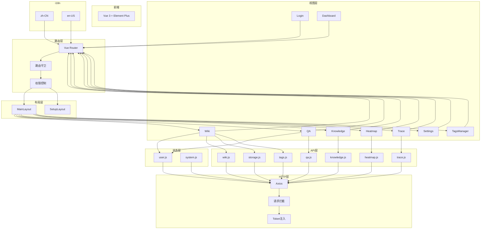
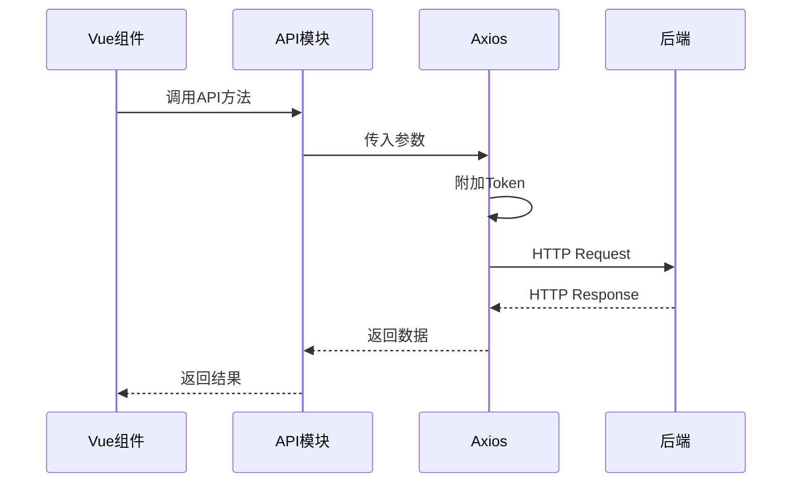
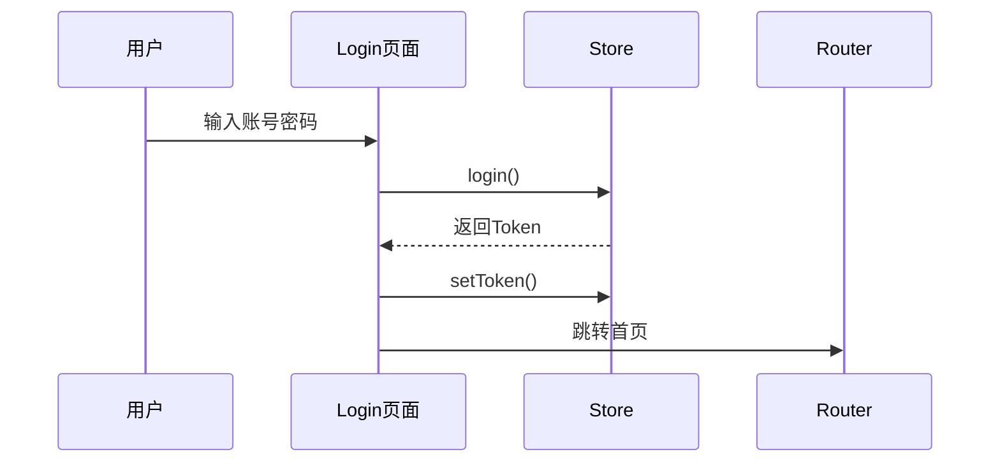
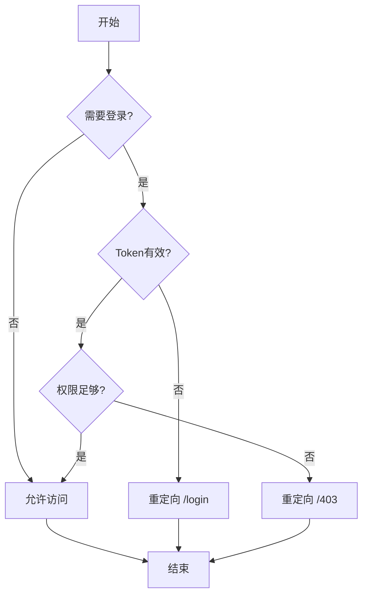
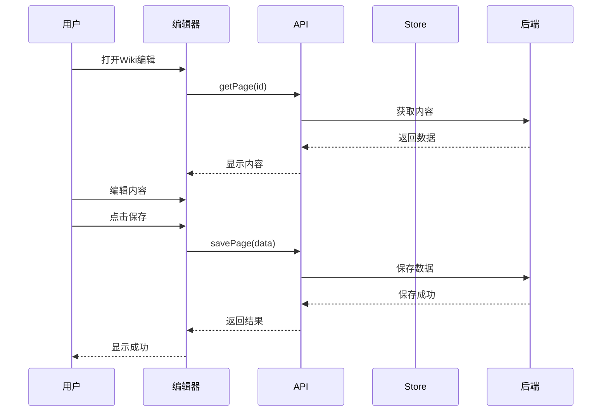

# Knowledge Platform - 前端代码结构图

## 文档信息
- **版本号**: v1.0.0
- **更新时间**: 2026-05-25
- **适用版本**: Knowledge Platform v0.1.0

---

## 一、项目整体架构



---

## 二、目录结构

```
frontend/
├── public/                           # 静态资源
│   ├── favicon.svg                  # 网站图标
│   └── icons.svg                    # 图标资源
├── src/                             # 源代码
│   ├── api/                         # API 接口层
│   ├── assets/                      # 静态资源（样式、图片）
│   ├── i18n/                        # 国际化
│   ├── router/                      # 路由配置
│   ├── stores/                      # 状态管理
│   ├── views/                       # 页面组件
│   ├── App.vue                      # 根组件
│   └── main.js                      # 入口文件
├── index.html                       # HTML 模板
├── package.json                     # 依赖配置
├── vite.config.js                   # Vite 配置
└── README.md                        # 项目说明
```

---

## 三、模块详细说明

### 3.1 API 层 (`src/api/`)

| 文件 | 功能说明 | 核心方法 |
|------|----------|----------|
| `request.js` | HTTP 请求封装（Axios） | `get`, `post`, `put`, `delete`, `request` |
| `wiki.js` | Wiki 文档接口 | `listPages`, `getPage`, `createPage`, `updatePage`, `deletePage`, `search` |
| `qa.js` | 智能问答接口 | `query`, `chat`, `feedback` |
| `knowledge.js` | 知识导航接口 | `getTree`, `createNode`, `updateNode`, `deleteNode` |
| `storage.js` | 对象存储接口 | `upload`, `download`, `list`, `delete` |
| `tags.js` | 标签管理接口 | `listTags`, `createTag`, `updateTag`, `deleteTag` |
| `system.js` | 系统配置接口 | `getHealth`, `getSettings`, `updateSettings` |
| `heatmap.js` | 热力图统计接口 | `getStats`, `getTrends` |
| `trace.js` | 链路追踪接口 | `getTraces`, `getTraceDetail` |

**request.js 核心方法说明**:

| 方法 | 功能 | 参数 | 返回值 |
|------|------|------|--------|
| `get(url, params, config)` | GET 请求 | `url`: 接口地址, `params`: 查询参数 | Promise |
| `post(url, data, config)` | POST 请求 | `url`: 接口地址, `data`: 请求体 | Promise |
| `put(url, data, config)` | PUT 请求 | `url`: 接口地址, `data`: 请求体 | Promise |
| `delete(url, params, config)` | DELETE 请求 | `url`: 接口地址, `params`: 查询参数 | Promise |

### 3.2 页面组件 (`src/views/`)

| 文件 | 功能说明 | 核心组件/方法 |
|------|----------|--------------|
| `Login.vue` | 登录页面 | 表单验证、Token 存储、跳转首页 |
| `Dashboard.vue` | 仪表盘首页 | 统计卡片、快捷入口、最近更新 |
| `Wiki.vue` | Wiki 文档管理 | 文档列表、编辑器、版本历史、搜索 |
| `QA.vue` | 智能问答页面 | 聊天界面、问答交互、来源展示 |
| `Knowledge.vue` | 知识导航页面 | 树形导航、节点管理、内容关联 |
| `Heatmap.vue` | 热力图统计页面 | 图表展示、趋势分析、数据筛选 |
| `Trace.vue` | 链路追踪页面 | Trace 列表、Span 详情、性能分析 |
| `views/admin/Settings.vue` | 系统设置页面 | 配置管理、参数修改 |
| `views/admin/TagsManager.vue` | 标签管理页面 | 标签列表、创建/编辑/删除 |
| `views/layout/MainLayout.vue` | 主布局组件 | 侧边栏、顶部导航、路由视图 |
| `views/setup/SetupLayout.vue` | 初始化向导布局 | 步骤导航、表单验证 |

**Wiki.vue 核心功能**:

| 功能模块 | 说明 |
|----------|------|
| 文档列表 | 支持树形展示、分页、搜索筛选 |
| 富文本编辑器 | Markdown 编辑、预览、历史对比 |
| 版本管理 | 版本历史查看、回滚、差异对比 |
| 权限控制 | 根据角色显示可访问文档 |

**QA.vue 核心功能**:

| 功能模块 | 说明 |
|----------|------|
| 聊天界面 | 消息气泡、时间戳、加载状态 |
| 问答交互 | 提问、回答展示、来源引用 |
| 上下文管理 | 多轮对话、历史记录 |
| 反馈功能 | 点赞/差评、反馈理由 |

### 3.3 状态管理 (`src/stores/`)

| 文件 | 功能说明 | 核心状态 |
|------|----------|----------|
| `user.js` | 用户状态管理 | `userInfo`, `roles`, `permissions`, `token` |
| `system.js` | 系统状态管理 | `sidebarCollapsed`, `theme`, `locale`, `loading` |

**user.js 核心方法**:

| 方法 | 功能 |
|------|------|
| `login(credentials)` | 用户登录 |
| `logout()` | 用户登出 |
| `getUserInfo()` | 获取用户信息 |
| `setToken(token)` | 设置 Token |
| `clearToken()` | 清除 Token |

**system.js 核心方法**:

| 方法 | 功能 |
|------|------|
| `toggleSidebar()` | 切换侧边栏折叠状态 |
| `setTheme(theme)` | 设置主题 |
| `setLocale(locale)` | 设置语言 |
| `startLoading()` | 开始加载 |
| `stopLoading()` | 停止加载 |

### 3.4 路由配置 (`src/router/index.js`)

| 路由路径 | 组件 | 权限要求 |
|----------|------|----------|
| `/login` | `Login.vue` | 无 |
| `/` | `Dashboard.vue` | 已登录 |
| `/wiki` | `Wiki.vue` | 已登录 |
| `/qa` | `QA.vue` | 已登录 |
| `/knowledge` | `Knowledge.vue` | 已登录 |
| `/heatmap` | `Heatmap.vue` | 已登录 |
| `/trace` | `Trace.vue` | admin |
| `/admin/settings` | `Settings.vue` | admin |
| `/admin/tags` | `TagsManager.vue` | admin |

### 3.5 国际化 (`src/i18n/`)

| 目录 | 语言 | 文件 |
|------|------|------|
| `en-US/` | 英语 | `common.js`, `dashboard.js`, `wiki.js`, `qa.js`, `knowledge.js`, `login.js`, `settings.js`, `setup.js`, `heatmap.js` |
| `zh-CN/` | 中文 | `common.js`, `dashboard.js`, `wiki.js`, `qa.js`, `knowledge.js`, `login.js`, `settings.js`, `setup.js`, `tags.js`, `heatmap.js` |

**i18n 结构说明**:

```
i18n/
├── en-US/
│   ├── index.js          # 语言包入口
│   ├── common.js         # 通用翻译（按钮、提示等）
│   ├── dashboard.js      # 仪表盘页面翻译
│   ├── wiki.js           # Wiki 页面翻译
│   ├── qa.js             # 问答页面翻译
│   ├── knowledge.js      # 知识导航页面翻译
│   ├── login.js          # 登录页面翻译
│   ├── settings.js       # 设置页面翻译
│   ├── setup.js          # 初始化向导翻译
│   └── heatmap.js        # 热力图页面翻译
├── zh-CN/
│   └── ...               # 同上
└── index.js              # i18n 配置入口
```

### 3.6 静态资源 (`src/assets/`)

| 文件/目录 | 功能说明 |
|-----------|----------|
| `styles/design-system.css` | 设计系统样式（颜色、字体、间距等） |
| `hero.png` | 首页英雄区域图片 |
| `vite.svg` | Vite 图标 |
| `vue.svg` | Vue 图标 |

### 3.7 入口文件 (`src/main.js`)

| 功能 | 说明 |
|------|------|
| Vue 实例创建 | 创建并挂载根组件 |
| 路由配置 | 注册路由插件 |
| 状态管理 | 注册 Pinia stores |
| 国际化 | 配置 i18n |
| 样式导入 | 导入全局样式 |

---

## 四、数据流

### 4.1 请求流程



### 4.2 认证流程



### 4.3 路由守卫流程



### 4.4 Wiki 编辑流程



---

## 五、技术栈

| 类别 | 技术 | 版本 |
|------|------|------|
| 框架 | Vue | 3.x |
| 构建工具 | Vite | 6.x |
| UI 组件库 | Element Plus | ^2.0 |
| 状态管理 | Pinia | ^2.0 |
| 路由 | Vue Router | ^4.0 |
| 国际化 | vue-i18n | ^9.0 |
| HTTP 客户端 | Axios | ^1.0 |
| Markdown | marked | ^12.0 |

---

## 六、关键组件说明

### 6.1 MainLayout.vue

| 组成部分 | 功能 |
|----------|------|
| 侧边栏 | 导航菜单、Logo、用户信息 |
| 顶部栏 | 面包屑、搜索框、通知、用户菜单 |
| 主内容区 | 路由视图出口 |

### 6.2 Login.vue

| 组成部分 | 功能 |
|----------|------|
| 登录表单 | 用户名、密码输入框 |
| 表单验证 | 必填校验、格式校验 |
| 登录按钮 | 触发登录请求 |
| 错误提示 | 显示登录失败信息 |
| 初始化入口 | 首次使用引导 |

---

## 七、版本历史

| 版本 | 更新时间 | 更新内容 |
|------|----------|----------|
| v1.0.0 | 2026-05-25 | 初始版本，包含完整前端代码结构 |
