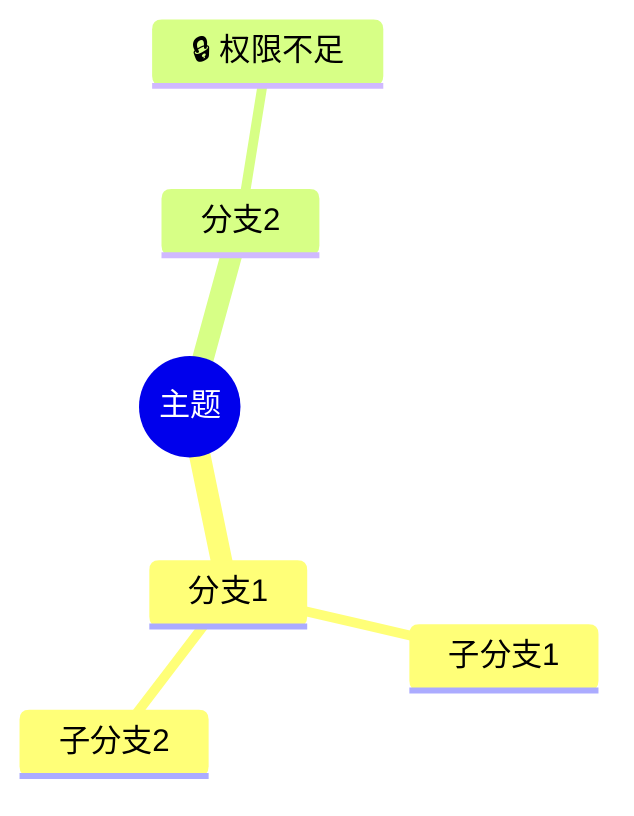

# 需求文档：思维导图 Agent

## 1. 需求概述

思维导图 Agent 负责检索多源知识，生成结构化思维导图，支持 JSON 和 Mermaid 格式输出。

---

## 2. 功能需求

### 2.1 思维导图生成

| 需求编号 | 需求描述 | 来源 |
|----------|----------|------|
| MIND-001 | 根据提示词生成结构化资料的思维导图 | README.md 第1节 |
| MIND-002 | 支持 JSON 格式输出 | README.md 第3节 |
| MIND-003 | 支持 Mermaid 格式输出 | README.md 第3节 |

### 2.2 知识导航整合

| 需求编号 | 需求描述 | 来源 |
|----------|----------|------|
| MIND-004 | 结合知识导航树结构生成思维导图 | README.md 第9节 |
| MIND-005 | 将相关文档内容映射到对应的导航节点下 | README.md 第9节 |
| MIND-006 | 使思维导图与企业知识体系一致 | README.md 第9节 |

### 2.3 权限感知

| 需求编号 | 需求描述 | 来源 |
|----------|----------|------|
| MIND-007 | 若请求涉及受限内容，标注"🔒权限不足" | README.md 第9节 |
| MIND-008 | 受限节点不展示具体内容 | README.md 第9节 |

### 2.4 多源知识检索

| 需求编号 | 需求描述 | 来源 |
|----------|----------|------|
| MIND-009 | 从 Wiki 检索相关文档 | README.md 第3节 |
| MIND-010 | 从向量库检索相关问答 | README.md 第3节 |
| MIND-011 | 从数据库检索相关档案 | README.md 第3节 |

---

## 3. 输出格式需求

### 3.1 JSON 格式

```json
{
  "title": "思维导图标题",
  "nodes": [
    {
      "id": "node-1",
      "text": "节点内容",
      "parentId": null,
      "children": [...],
      "permission": "allowed|denied",
      "source": {"type": "wiki|vector|db", "id": "xxx"}
    }
  ]
}
```

### 3.2 Mermaid 格式



---

## 4. 非功能需求

| 需求编号 | 需求描述 |
|----------|----------|
| MIND-NFR-001 | 思维导图生成时间 < 5000ms |
| MIND-NFR-002 | 导图结构层级不超过 5 层 |
