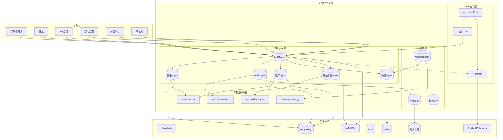

# 软件需求规格说明书

## 1. 项目背景与目标

### 1.1 业务问题

企业内部存在三类异构知识资产：制度文件（Wiki）、个人会话问答（非结构化QA历史）、员工档案（考勤、绩效、打卡等结构化数据）。当前面临以下核心问题：

- **知识孤岛**：三类知识分散存储，缺乏统一检索入口
- **权限混乱**：缺乏细粒度的数据权限控制，敏感信息存在泄露风险
- **知识无序**：文档提交后缺乏自动分类机制
- **协作低效**：跨库联合查询需要人工完成
- **安全隐患**：缺少统一身份认证和权限校验机制

### 1.2 解决方案目标

构建一个**安全可控、分级授权、自动归类**的多Agent协同动态知识库平台：

1. 统一知识存储：Wiki引擎 + 向量数据库 + 关系型数据库
2. 全链路权限防护：权限管控Agent确保精细化鉴权
3. 动态知识导航：预设导航树结构 + 自动分类
4. 多Agent协作：智能问答与跨库查询
5. 可视化输出：思维导图生成

***

## 2. 系统上下文与参与者

### 2.1 系统边界

### 2.2 参与者清单

| 参与者       | 角色描述    | 核心目标                        |
| --------- | ------- | --------------------------- |
| **系统管理员** | 平台运维人员  | 初始化系统、管理配置、查看审计日志           |
| **员工**    | 普通用户    | 登录平台、浏览Wiki、发起问答、查看档案       |
| **HR经理**  | 人力资源管理者 | 管理员工档案、行级安全控制、敏感数据脱敏        |
| **部门经理**  | 团队管理者   | 查看本部门员工记录、跨库联合查询            |
| **内容作者**  | 文档编写人员  | 创建/编辑Wiki文档、使用Markdown、版本管理 |
| **审核员**   | 内容审核人员  | 敏感词过滤、格式修正、内容质量检查           |

***

## 3. 用例模型

### 3.1 用例层级列表

| 层级        | 用例名称      | 描述                 | 参与者       | 状态 |
| --------- | --------- | ------------------ | --------- | -- |
| **概要级别**  | 完成智能问答    | 用户提交问题，系统返回答文      | 员工、部门经理   | ✅ |
| **概要级别**  | 管理知识文档    | 创建、编辑、分类、审核Wiki文档  | 内容作者、审核员  | ✅ |
| **概要级别**  | 管理员工档案    | 查询、统计员工信息，行级权限控制   | HR经理、部门经理 | ✅ |
| **用户目标级** | 登录认证      | 使用用户名密码登录获取JWT     | 所有用户      | ✅ |
| **用户目标级** | 初始化系统     | 5步向导配置系统参数         | 管理员       | ✅ |
| **用户目标级** | Wiki全文搜索  | 通过关键词搜索Wiki文档      | 所有用户      | ✅ |
| **用户目标级** | 向量语义搜索    | 语义匹配历史问答记录         | 所有用户      | ✅ |
| **用户目标级** | 知识导航浏览    | 通过导航树浏览知识结构        | 所有用户      | ✅ |
| **用户目标级** | 跨库联合查询    | 查询制度+考勤等复合问题       | 部门经理      | ✅ |
| **用户目标级** | 生成思维导图    | 从文档生成知识图谱          | 培训人员      | ✅ |
| **子功能级**  | 意图分类      | 判断用户提问意图           | 系统内部      | ✅ |
| **子功能级**  | SQL注入检测   | 检测并阻止攻击            | 系统内部      | ✅ |
| **子功能级**  | RBAC权限校验  | 验证用户操作权限           | 系统内部      | ✅ |
| **子功能级**  | 敏感字段脱敏    | 根据角色隐藏敏感数据         | 系统内部      | ✅ |
| **子功能级**  | 自动分类推荐    | 文档提交时推荐类别          | 系统内部      | ✅ |
| **子功能级**  | 敏感词检测     | 检测不当内容             | 系统内部      | ✅ |
| **概要级别**  | 查看热力图     | 发现热门知识和检索趋势        | 所有用户      | ✅ |
| **用户目标级** | 查看热门榜单    | 浏览热门查询词和文档         | 所有用户      | ✅ |
| **用户目标级** | 查看时间热力图   | 了解不同时段检索热度         | 所有用户      | ✅ |
| **用户目标级** | 查看导航热度    | 发现知识导航热点节点         | 所有用户      | ✅ |
| **概要级别**  | 文档版本管理    | 创建、编辑、查看Wiki文档版本历史 | 内容作者      | ✅ |
| **用户目标级** | 文档上传到对象存储 | 将文档内容存储到对象存储       | 内容作者      | ✅ |
| **用户目标级** | 文档切片与向量化  | 自动处理文档并生成向量        | 系统内部      | ✅ |
| **用户目标级** | 标签管理      | 创建、编辑、删除Wiki标签     | 内容作者、管理员  | ✅ |
| **用户目标级** | 对象存储配置    | 配置MinIO/S3/OSS存储参数 | 系统管理员     | ✅ |
| **用户目标级** | 切片规则管理    | 创建、编辑、排序文档切片规则     | 系统管理员     | ✅ |

***

## 4. 详细需求

详细需求已按模块拆分为独立文档，以下为需求索引：

### 4.1 功能性需求

#### 4.1.1 认证授权模块（FR-AUTH）

- [FR-AUTH-001: 本地用户登录](detailed/FR-AUTH.md) ✅
- [FR-AUTH-002: 内置管理员初始化](detailed/FR-AUTH.md) ✅
- [FR-AUTH-003: 用户密码修改](detailed/FR-AUTH.md) ✅
- [FR-AUTH-004: Keycloak OAuth2集成](detailed/FR-AUTH.md) ✅

#### 4.1.2 Wiki文档模块（FR-WIKI）

- [FR-WIKI-001: Wiki文档创建](detailed/FR-WIKI.md) ✅
- [FR-WIKI-002: Wiki文档编辑](detailed/FR-WIKI.md) ✅
- [FR-WIKI-003: Wiki文档删除](detailed/FR-WIKI.md) ✅
- [FR-WIKI-004: Wiki全文搜索](detailed/FR-WIKI.md) ✅
- [FR-WIKI-005: 文档敏感度分级](detailed/FR-WIKI.md) ✅
- [FR-WIKI-006: 文档级ACL权限](detailed/FR-WIKI.md) ✅

#### 4.1.3 向量搜索模块（FR-VECTOR）

- [FR-VECTOR-001: 向量插入](detailed/FR-VECTOR.md) ✅
- [FR-VECTOR-002: 向量语义搜索](detailed/FR-VECTOR.md) ✅
- [FR-VECTOR-003: 向量权限过滤](detailed/FR-VECTOR.md) ✅

#### 4.1.13 对象存储模块（FR-STORAGE）

- [FR-STORAGE-001: 文档版本管理](detailed/FR-STORAGE.md) ✅
- [FR-STORAGE-002: 对象存储上传](detailed/FR-STORAGE.md) ✅
- [FR-STORAGE-003: 对象存储下载](detailed/FR-STORAGE.md) ✅
- [FR-STORAGE-004: 多提供商支持](detailed/FR-STORAGE.md) ✅
- [FR-STORAGE-005: 预签名URL生成](detailed/FR-STORAGE.md) ✅

#### 4.1.14 文档处理模块（FR-DOC-PROCESS）

- [FR-DOC-PROCESS-001: 文档切片处理](detailed/FR-DOC-PROCESS.md) ✅
- [FR-DOC-PROCESS-002: 智能切片策略](detailed/FR-DOC-PROCESS.md) ✅
- [FR-DOC-PROCESS-003: 文档向量化](detailed/FR-DOC-PROCESS.md) ✅
- [FR-DOC-PROCESS-004: 处理状态管理](detailed/FR-DOC-PROCESS.md) ✅

#### 4.1.15 标签管理模块（FR-TAGS）

- [FR-TAGS-001: 标签CRUD](detailed/FR-TAGS.md) ✅
- [FR-TAGS-002: 标签树形结构](detailed/FR-TAGS.md) ✅
- [FR-TAGS-003: 页面标签关联](detailed/FR-TAGS.md) ✅

#### 4.1.16 切片规则模块（FR-CHUNKING）

- [FR-CHUNKING-001: 规则CRUD](detailed/FR-CHUNKING.md) ✅
- [FR-CHUNKING-002: 策略模式支持](detailed/FR-CHUNKING.md) ✅
- [FR-CHUNKING-003: 规则排序](detailed/FR-CHUNKING.md) ✅

#### 4.1.4 员工数据库模块（FR-DB）

- [FR-DB-001: 员工档案查询](detailed/FR-DB.md) ✅
- [FR-DB-002: 员工统计查询](detailed/FR-DB.md) ✅
- [FR-DB-003: 敏感字段脱敏](detailed/FR-DB.md) ✅
- [FR-DB-004: 行级安全策略](detailed/FR-DB.md) ✅

#### 4.1.5 知识导航模块（FR-NAV）

- [FR-NAV-001: 导航树CRUD](detailed/FR-NAV.md) ✅
- [FR-NAV-002: 内容关联](detailed/FR-NAV.md) ✅
- [FR-NAV-003: 自动分类推荐](detailed/FR-NAV.md) ✅
- [FR-NAV-004: 关键词映射导航](detailed/FR-NAV.md) ✅
- [FR-NAV-005: 定期重分类](detailed/FR-NAV.md) ✅

#### 4.1.6 审核优化模块（FR-REVIEW）

- [FR-REVIEW-001: 敏感词检查](detailed/FR-REVIEW.md) ✅
- [FR-REVIEW-002: Markdown格式修正](detailed/FR-REVIEW.md) ✅
- [FR-REVIEW-003: 内容质量检查](detailed/FR-REVIEW.md) ✅
- [FR-REVIEW-004: 审核流程集成](detailed/FR-REVIEW.md) ✅

#### 4.1.7 路由Agent模块（FR-ROUTER）

- [FR-ROUTER-001: 意图分类](detailed/FR-ROUTER.md) ✅
- [FR-ROUTER-002: SQL注入检测](detailed/FR-ROUTER.md) ✅

#### 4.1.8 协调Agent模块（FR-COORD）

- [FR-COORD-001: 数据库查询处理](detailed/FR-COORD.md) ✅
- [FR-COORD-002: 知识库查询处理](detailed/FR-COORD.md) ✅
- [FR-COORD-003: 混合查询处理](detailed/FR-COORD.md) ✅
- [FR-COORD-004: 结果来源标注](detailed/FR-COORD.md) ✅

#### 4.1.9 权限Agent模块（FR-PERM）

- [FR-PERM-001: RBAC角色鉴权](detailed/FR-PERM.md) ✅
- [FR-PERM-002: 可访问范围查询](detailed/FR-PERM.md) ✅
- [FR-PERM-003: 动态策略热更新](detailed/FR-PERM.md) ✅

#### 4.1.10 思维导图Agent模块（FR-MINDMAP）

- [FR-MINDMAP-001: JSON树生成](detailed/FR-MINDMAP.md) ✅
- [FR-MINDMAP-002: Mermaid转换](detailed/FR-MINDMAP.md) ✅
- [FR-MINDMAP-003: 导航结构整合](detailed/FR-MINDMAP.md) ✅

#### 4.1.11 系统管理模块（FR-SYSTEM）

- [FR-SYSTEM-001: 初始化向导](detailed/FR-SYSTEM.md) ✅
- [FR-SYSTEM-002: 配置管理](detailed/FR-SYSTEM.md) ✅
- [FR-SYSTEM-003: 连接测试](detailed/FR-SYSTEM.md) ✅
- [FR-SYSTEM-004: 审计日志查询](detailed/FR-SYSTEM.md) ✅
- [FR-SYSTEM-005: 热重载](detailed/FR-SYSTEM.md) ✅

#### 4.1.12 热力图模块（FR-HEATMAP）

- [FR-HEATMAP-001: 检索事件埋点](detailed/FR-HEATMAP.md) ✅
- [FR-HEATMAP-002: 热门查询词榜单](detailed/FR-HEATMAP.md) ✅
- [FR-HEATMAP-003: 热门文档榜单](detailed/FR-HEATMAP.md) ✅
- [FR-HEATMAP-004: 时间热力图展示](detailed/FR-HEATMAP.md) ✅
- [FR-HEATMAP-005: 知识导航热度标记](detailed/FR-HEATMAP.md) ✅
- [FR-HEATMAP-006: Dashboard热门推荐入口](detailed/FR-HEATMAP.md) ✅
- [FR-HEATMAP-007: 热度数据聚合后台任务](detailed/FR-HEATMAP.md) ✅
- [FR-HEATMAP-008: 热力图多语言支持](detailed/FR-HEATMAP.md) ✅
- [FR-HEATMAP-009: 热力图响应式设计](detailed/FR-HEATMAP.md) ✅

### 4.2 非功能需求

#### 4.2.1 性能需求（NFR-PERF）

- [NFR-PERF-001: 响应时间](detailed/NFR-PERF.md)
- [NFR-PERF-002: 并发处理](detailed/NFR-PERF.md)

#### 4.2.2 安全性需求（NFR-SEC）

- [NFR-SEC-001: 数据加密](detailed/NFR-SEC.md)
- [NFR-SEC-002: JWT安全性](detailed/NFR-SEC.md)
- [NFR-SEC-003: SQL注入防护](detailed/NFR-SEC.md)

#### 4.2.3 用户体验需求（NFR-USAB）

- [NFR-USAB-001: 多语言支持](detailed/NFR-USAB.md)
- [NFR-USAB-002: 响应式设计](detailed/NFR-USAB.md)

#### 4.2.4 可靠性需求（NFR-RELI）

- [NFR-RELI-001: 可用性](detailed/NFR-RELI.md)
- [NFR-RELI-002: 数据备份](detailed/NFR-RELI.md)

***

## 5. 需求优先级与范围推导

### 5.1 KANO分类结果

| 类别                       | 数量 | 需求示例                              |
| ------------------------ | -- | --------------------------------- |
| **基本型（Must-be）**         | 18 | 登录认证、Wiki CRUD、向量搜索、RBAC鉴权、敏感字段脱敏 |
| **期望型（One-dimensional）** | 22 | 用户管理、细粒度ACL、审核流程、审计日志、热重载         |
| **兴奋型（Attractive）**      | 10 | 自动分类、定期重分类、混合查询、思维导图、来源标注         |

### 5.2 RICE评分表

| 需求       | 触达(Reach) | 影响(Impact) | 信心(Confidence) | 工作量(Effort) | RICE得分 | 优先级 | 状态 |
| -------- | --------- | ---------- | -------------- | ----------- | ------ | --- | -- |
| 跨库混合查询   | 80%       | 90%        | 70%            | 8           | 6.3    | P0  | ✅ |
| 审核流程集成   | 60%       | 70%        | 80%            | 5           | 6.7    | P0  | ✅ |
| 来源标注     | 90%       | 80%        | 70%            | 4           | 12.6   | P1  | ✅ |
| 用户管理CRUD | 40%       | 60%        | 90%            | 3           | 7.2    | P1  | ✅ |
| 动态策略热更新  | 30%       | 50%        | 60%            | 4           | 2.25   | P2  | ⚠️ |
| 定期重分类任务  | 20%       | 40%        | 50%            | 3           | 1.33   | P2  | ✅ |
| 思维导图前端   | 15%       | 30%        | 40%            | 6           | 0.3    | P3  | ✅ |

### 5.3 MVP范围与迭代计划

#### 当前已完成（Phase 1 + Phase 2 + Phase 3）✅

- 登录认证（本地JWT + Keycloak OAuth2）
- Wiki CRUD + 版本历史 + 全文搜索 + ACL权限
- 向量搜索 + 权限过滤
- 员工档案查询 + 敏感字段脱敏 + 行级安全
- RBAC权限完整实现
- 编排Agent（意图分类、SQL注入检测、跨库查询、结果聚合）
- 知识导航树CRUD + 自动分类推荐 + 定期重分类
- 敏感词检测 + 审核流程集成
- 系统初始化向导 + 配置管理
- 对象存储（MinIO/S3/OSS）+ 文档处理（切片、向量化）
- 标签管理 + 切片规则管理
- 热力图（检索埋点、热门榜单、时间热力图、导航热度）
- 思维导图生成（JSON + Mermaid）

#### 待实现功能 ⚠️

1. **系统热重载**（FR-SYSTEM-005）
2. **外源MCP支持**

***

## 6. 需求跟踪矩阵

### 6.1 业务目标与Agent映射

| 业务目标     | 目标级用例     | 功能需求ID                         | 业务Agent    | Skill               | 状态 |
| -------- | --------- | ------------------------------ | ---------- | ------------------- | -- |
| 统一知识检索   | Wiki全文搜索  | FR-WIKI-004                    | Wiki Agent | -                   | ✅ |
| 统一知识检索   | 向量语义搜索    | FR-VECTOR-002                  | 向量Agent    | -                   | ✅ |
| 统一知识检索   | 跨库联合查询    | FR-COORD-003                   | 编排Agent    | -                   | ✅ |
| 细粒度权限控制  | RBAC角色鉴权  | FR-PERM-001                    | 安全Agent    | -                   | ✅ |
| 细粒度权限控制  | 敏感字段脱敏    | FR-DB-003                      | 安全Agent    | security-utils      | ✅ |
| 细粒度权限控制  | 行级安全策略    | FR-DB-004                      | 轻库Agent    | security-utils      | ✅ |
| 自动知识分类   | 自动分类推荐    | FR-NAV-003                     | Wiki Agent | content-classifier  | ✅ |
| 自动知识分类   | 定期重分类     | FR-NAV-005                     | Wiki Agent | content-classifier  | ✅ |
| 多Agent协作 | 意图分类      | FR-ROUTER-001                  | 编排Agent    | -                   | ✅ |
| 多Agent协作 | SQL注入检测   | FR-ROUTER-002                  | 安全Agent    | security-utils      | ✅ |
| 多Agent协作 | 结果聚合      | FR-COORD-004                   | 编排Agent    | -                   | ✅ |
| 可视化输出    | 思维导图生成    | FR-MINDMAP-001                 | 思维导图Agent  | -                   | ✅ |
| 可视化输出    | Mermaid转换 | FR-MINDMAP-002                 | 思维导图Agent  | mermaid-renderer    | ✅ |
| 系统管理     | 初始化向导     | FR-SYSTEM-001                  | 系统服务       | -                   | ✅ |
| 系统管理     | 审计日志      | FR-SYSTEM-004                  | 系统服务       | -                   | ✅ |
| 知识发现     | 查看热力图     | FR-HEATMAP-004                 | 热力图服务      | -                   | ✅ |
| 知识发现     | 查看热门榜单    | FR-HEATMAP-002, FR-HEATMAP-003 | 热力图服务      | -                   | ✅ |
| 知识发现     | 查看导航热度    | FR-HEATMAP-005                 | 热力图服务      | -                   | ✅ |
| 数据埋点     | 检索事件记录    | FR-HEATMAP-001                 | 热力图服务      | -                   | ✅ |
| 文档版本管理   | 文档版本管理    | FR-STORAGE-001                 | Wiki Agent | -                   | ✅ |
| 对象存储     | 对象存储上传    | FR-STORAGE-002                 | 存储服务       | -                   | ✅ |
| 对象存储     | 对象存储下载    | FR-STORAGE-003                 | 存储服务       | -                   | ✅ |
| 文档处理     | 文档切片处理    | FR-DOC-PROCESS-001             | 文档处理服务     | chunking-strategy   | ✅ |
| 文档处理     | 文档向量化     | FR-DOC-PROCESS-003             | 文档处理服务     | -                   | ✅ |
| 标签管理     | 标签CRUD    | FR-TAGS-001                    | 标签服务       | -                   | ✅ |
| 切片规则     | 规则CRUD    | FR-CHUNKING-001                | 文档处理服务     | chunking-strategy   | ✅ |

### 6.2 Agent与Skill关系矩阵

| 业务Agent/服务     | 职责                      | 调用的Skill           | 被编排Agent调用 |
| -------------- | ----------------------- | ------------------ | ---------- |
| **安全Agent**    | SQL注入检测、RBAC鉴权、敏感字段脱敏   | security-utils     | ✅          |
| **编排Agent**    | 意图识别、任务分解、跨Agent协调、结果聚合 | -                  | -          |
| **Wiki Agent** | Wiki文档CRUD、全文检索         | content-classifier | ✅          |
| **轻库Agent**    | 员工档案查询、行级安全             | security-utils     | ✅          |
| **向量Agent**    | 向量嵌入、语义搜索               | -                  | ✅          |
| **思维导图Agent**  | 导图生成、知识整合               | mermaid-renderer   | ✅          |
| **热力图服务**      | 检索埋点、热度统计、热门榜单、时间热力图    | -                  | ✅          |
| **存储服务**       | 对象存储操作、多提供商支持、预签名URL生成  | -                  | ✅          |
| **文档处理服务**     | 文档切片、向量化处理、处理状态管理       | chunking-strategy  | ✅          |
| **标签服务**       | 标签CRUD、树形结构管理、页面标签关联    | -                  | ✅          |

### 6.3 Skill能力清单

| Skill名称              | 能力描述                     | 被调用方            | 状态 |
| -------------------- | ------------------------ | --------------- | -- |
| `security-utils`     | SQL注入检测、敏感词检测、敏感字段脱敏     | 安全Agent、轻库Agent | ✅ |
| `content-classifier` | 内容分类、标签提取、语义聚类、格式优化、文本摘要 | Wiki Agent      | ✅ |
| `mermaid-renderer`   | Mermaid语法生成与渲染           | 思维导图Agent       | ✅ |
| `chunking-strategy`  | 基于规则切片、基于LLM智能切片、可配置切片策略 | 文档处理服务          | ✅ |

### 6.4 MCP协议层

| 模块          | 职责                 | 集成状态 |
| ----------- | ------------------ | ---- |
| **统一MCP协议** | 支持内嵌MCP和外源MCP      | ✅    |
| **内嵌MCP**   | 自研Agent，注册表管理，低耦合  | ✅    |
| **外源MCP**   | 标准MCP Server，配置化管理 | ⚠️    |

***

## 7. 附录

### 7.1 原始文档信息摘要

- **PRD文档**: 30个用户故事，4个实施阶段
- **需求规划**: 4个阶段，70+功能点，当前整体进度\~95%
- **项目结构**: 后端（FastAPI）、前端（Vue3）、基础设施（Docker）
- **架构重构**: 从8个Agent重构为6个Agent，优化Skill调用方式，支持标准MCP协议

### 7.2 已完成功能统计（新架构）

#### 业务Agent层

| Agent          | 职责                     | 总功能数 | 已完成 | 部分实现 | 未实现 | 完成率   |
| -------------- | ---------------------- | ---- | --- | ---- | --- | ----- |
| **安全Agent**    | SQL注入检测、RBAC鉴权、敏感字段脱敏     | 3    | 3   | 0    | 0   | 100%  |
| **编排Agent**    | 意图识别、任务分解、跨Agent协调、结果聚合 | 4    | 4   | 0    | 0   | 100%  |
| **Wiki Agent** | Wiki文档CRUD+全文检索+版本管理     | 7    | 7   | 0    | 0   | 100%  |
| **向量Agent**    | 向量嵌入、语义搜索、权限过滤         | 4    | 4   | 0    | 0   | 100%  |
| **轻库Agent**    | 员工档案查询、行级安全、敏感字段脱敏      | 4    | 4   | 0    | 0   | 100%  |
| **思维导图Agent**  | 导图生成、知识整合、格式转换         | 4    | 3   | 1    | 0   | 75%   |
| **系统服务**       | 认证、配置、审计日志             | 5    | 3   | 0    | 2   | 60%   |
| **热力图服务**      | 检索埋点、热度统计、热门榜单、时间热力图   | 9    | 9   | 0    | 0   | 100%  |
| **存储服务**       | 对象存储操作、多提供商支持、预签名URL生成  | 5    | 5   | 0    | 0   | 100%  |
| **文档处理服务**     | 文档切片、向量化处理、处理状态管理       | 4    | 4   | 0    | 0   | 100%  |
| **标签服务**       | 标签CRUD、树形结构管理、页面标签关联    | 3    | 3   | 0    | 0   | 100%  |

#### 可复用Skill层

| Skill                 | 能力                   | 状态 |
| --------------------- | -------------------- | -- |
| `security-utils`      | SQL注入检测、敏感词检测、敏感字段脱敏 | ✅  |
| `content-classifier`  | 内容分类、标签提取、语义聚类、格式优化、文本摘要 | ✅  |
| `mermaid-renderer`    | Mermaid语法生成与渲染       | ✅  |
| `chunking-strategy`   | 基于规则切片、基于LLM智能切片、可配置切片策略 | ✅  |

#### MCP协议层

| 模块          | 职责             | 状态 |
| ----------- | -------------- | -- |
| **统一MCP协议** | 支持内嵌MCP和外源MCP | ✅  |
| **外源MCP支持** | 标准MCP Server对接 | ⚠️  |

### 7.3 已完成功能汇总

**已实现的核心功能模块：**

1. **认证授权模块**：本地用户登录、内置管理员初始化、用户密码修改、Keycloak OAuth2集成
2. **Wiki文档模块**：文档CRUD、全文搜索、敏感度分级、文档级ACL权限、版本管理
3. **向量搜索模块**：向量插入、语义搜索、权限过滤
4. **员工数据库模块**：档案查询、统计查询、敏感字段脱敏、行级安全策略
5. **知识导航模块**：导航树CRUD、内容关联、自动分类推荐、关键词映射导航、定期重分类
6. **审核优化模块**：敏感词检查、Markdown格式修正、内容质量检查、审核流程集成
7. **编排Agent模块**：意图分类、SQL注入检测、数据库查询处理、知识库查询处理、混合查询处理、结果来源标注
8. **安全Agent模块**：RBAC角色鉴权、可访问范围查询、敏感字段脱敏
9. **思维导图Agent模块**：JSON树生成、Mermaid转换
10. **系统管理模块**：初始化向导、配置管理、连接测试
11. **热力图模块**：检索事件埋点、热门查询词榜单、热门文档榜单、时间热力图展示、知识导航热度标记、Dashboard热门推荐入口、热度数据聚合后台任务、多语言支持、响应式设计
12. **对象存储模块**：文档版本管理、对象存储上传/下载、多提供商支持（MinIO/S3/OSS）、预签名URL生成
13. **文档处理模块**：文档切片处理、智能切片策略、文档向量化、处理状态管理
14. **标签管理模块**：标签CRUD、标签树形结构、页面标签关联
15. **切片规则模块**：规则CRUD、策略模式支持、规则排序

### 7.4 待实现功能汇总

**待实现的功能：**

1. **FR-SYSTEM-005**: 系统热重载 - 支持配置和策略的热重载
2. **外源MCP支持** - 支持标准MCP Server的对接

### 7.5 新增需求说明

- **新增模块**: 热力图模块（FR-HEATMAP），包含9个功能需求，全部已实现
- **新增模块**: 动态策略热更新（FR-PERM-003），已实现
- **新增模块**: 思维导图导航整合（FR-MINDMAP-003），已实现
- **新增文档**:
  - [2026-05-23-heatmap-design.md](file:///d:/Project/Claude/knowledge/docs/superpowers/specs/2026-05-23-heatmap-design.md) - 后端设计文档
  - [2026-05-23-heatmap-frontend-design.md](file:///d:/Project/Claude/knowledge/docs/superpowers/specs/2026-05-23-heatmap-frontend-design.md) - 前端设计文档
  - [2026-05-25-dynamic-policy-hot-update-design.md](file:///d:/Project/Claude/knowledge/docs/superpowers/specs/2026-05-25-dynamic-policy-hot-update-design.md) - 动态策略热更新设计文档
  - [2026-05-25-mindmap-navigation-integration.md](file:///d:/Project/Claude/knowledge/docs/superpowers/plans/2026-05-25-mindmap-navigation-integration.md) - 思维导图导航整合实现计划
- **已实现功能**: 前端热力图页面、Dashboard入口、API接口、检索事件埋点、后台聚合任务、动态策略热重载API、思维导图导航整合功能

### 7.6 对象存储与文档处理需求说明

- **新增模块**: 对象存储模块（FR-STORAGE）、文档处理模块（FR-DOC-PROCESS）、标签管理模块（FR-TAGS）、切片规则模块（FR-CHUNKING），共16个功能需求，全部已实现
- **新增文档**:
  - [2026-05-23-object-storage-design.md](file:///d:/Project/Claude/knowledge/docs/superpowers/specs/2026-05-23-object-storage-design.md) - 对象存储与文档处理系统设计文档
- **设计目标**: 将Wiki文档内容从PostgreSQL迁移到对象存储，支持文档版本管理、切片和向量化
- **支持存储提供商**: MinIO（自托管）、AWS S3、阿里云OSS
- **文档处理流程**: 上传原始文件 → 保存元数据 → 异步切片处理 → 生成向量 → 存入Milvus
- **切片策略**: 支持基于规则的切片（标题、段落、长度）和基于LLM的智能切片

***

**文档版本**: v1.4
**更新日期**: 2026-05-25
**状态**: 已审核
**完成率**: ~95%