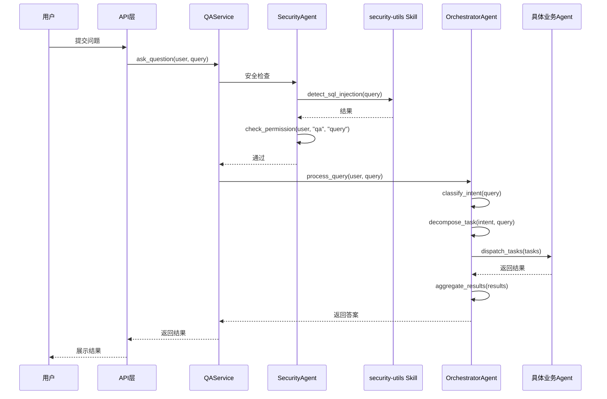

# Agent 架构重构设计文档

## 1. 概述

### 1.1 设计目标

重构现有的 Agent 架构，解决以下问题：
- RouterAgent 和 CoordinatorAgent 功能重叠
- ContentAnalysisAgent 可以简化为 Skill
- Security 相关功能可以更好地组织

### 1.2 变更范围

- 合并 RouterAgent 和 CoordinatorAgent 为 OrchestratorAgent
- 升级 PermissionAgent 为 SecurityAgent
- 删除 ContentAnalysisAgent，功能移至 Skill
- 调整 Skill 层结构

---

## 2. 架构设计

### 2.1 新的 Agent 架构

```
用户请求 → API 层
         ↓
    SecurityAgent（安全层）
         - 调用 security-utils Skill（通过统一接口）
         - RBAC权限检查
         ↓
    OrchestratorAgent（编排层）
         - 意图识别
         - 任务分解
         - 分发到具体 Agent（通过 MCP 协议）
         - 结果聚合
         ↓
    具体业务 Agent
         - WikiAgent
         - DBAgent
         - VectorAgent
         - MindMapAgent
         - [标准 MCP Server]（可选）
```

### 2.2 调用架构

```
┌─────────────────────────────────────────────────────────────────┐
│                         OrchestratorAgent                        │
├─────────────────────────────────────────────────────────────────┤
│  ┌──────────────────────┐    ┌──────────────────────────────┐  │
│  │  MCP Client          │    │  Skill Executor              │  │
│  │  - Local Agents      │    │  - 本地 Skills              │  │
│  │  - 标准 MCP Servers  │    │  - 统一接口调用             │  │
│  └──────────────────────┘    └──────────────────────────────┘  │
└─────────────────────────────────────────────────────────────────┘
         │                                    │
         ▼                                    ▼
┌─────────────────┐              ┌─────────────────────────┐
│     Agents      │              │         Skills          │
│  (MCP Protocol) │              │  (Unified Interface)    │
└─────────────────┘              └─────────────────────────┘
```

### 2.3 Agent 职责清单

| Agent | 职责 | 对应原 Agent | 状态 |
|-------|------|-------------|------|
| **SecurityAgent** | 安全检查编排、RBAC权限检查 | RouterAgent(SQL注入) + PermissionAgent | 新建 |
| **OrchestratorAgent** | 意图识别、任务分解、跨Agent协调、结果聚合 | RouterAgent(意图) + CoordinatorAgent | 新建 |
| **WikiAgent** | Wiki文档CRUD、全文搜索 | - | 保持 |
| **DBAgent** | 员工档案查询、行级安全 | - | 保持 |
| **VectorAgent** | 向量嵌入、语义搜索 | - | 保持 |
| **MindMapAgent** | 思维导图生成 | - | 保持 |
| **RouterAgent** | - | - | ❌ 删除 |
| **CoordinatorAgent** | - | - | ❌ 删除 |
| **PermissionAgent** | - | - | ❌ 删除 |
| **ContentAnalysisAgent** | - | - | ❌ 删除 |

### 2.4 Skill 层结构

| Skill | 能力 | 被调用方 | 状态 |
|-------|------|---------|------|
| `security-utils` | SQL注入检测、敏感词检测、敏感字段脱敏 | SecurityAgent、DBAgent | 新建（合并） |
| `content-classifier` | 内容分类、关键词提取、文本格式化、文本摘要 | WikiAgent 等 | 更新（扩展） |
| `mermaid-renderer` | Mermaid语法生成与渲染 | MindMapAgent | 保持 |
| `sql-inject-detector` | - | - | ❌ 删除（合并到 security-utils） |

---

## 3. 详细设计

### 3.1 SecurityAgent

#### 职责
1. 调用 `security-utils` Skill 进行 SQL 注入检测
2. 调用 `security-utils` Skill 进行敏感字段脱敏
3. RBAC 权限检查（Casbin）
4. 可访问范围查询

#### 接口设计

```python
class SecurityAgent:
    async def check_sql_injection(self, text: str) -> dict:
        """检查 SQL 注入"""
        pass
    
    async def check_permission(self, user: UserContext, resource: str, action: str) -> bool:
        """检查权限"""
        pass
    
    async def mask_sensitive_data(self, data: dict, resource_type: str) -> dict:
        """敏感字段脱敏"""
        pass
    
    async def get_accessible_scopes(self, user: UserContext, resource: str) -> list:
        """获取可访问范围"""
        pass
```

### 3.2 OrchestratorAgent

#### 职责
1. 意图识别（关键词 + LLM）
2. 任务分解
3. 分发任务到具体 Agent
4. 结果聚合
5. 生成最终答案

#### 接口设计

```python
class OrchestratorAgent:
    async def process_query(self, user: UserContext, query: str) -> dict:
        """处理用户查询"""
        pass
    
    async def classify_intent(self, query: str) -> dict:
        """意图分类"""
        pass
    
    async def decompose_task(self, intent: str, query: str) -> list:
        """任务分解"""
        pass
    
    async def dispatch_tasks(self, tasks: list) -> list:
        """分发任务"""
        pass
    
    async def aggregate_results(self, results: list) -> dict:
        """结果聚合"""
        pass
```

### 3.3 security-utils Skill

#### 职责
1. SQL 注入检测
2. 敏感词检测
3. 敏感字段脱敏

#### 接口设计

```python
class SecurityUtilsSkill:
    async def detect_sql_injection(self, text: str) -> dict:
        """检测 SQL 注入"""
        pass
    
    async def detect_sensitive_words(self, text: str) -> dict:
        """检测敏感词"""
        pass
    
    async def mask_sensitive_fields(self, data: dict, resource_type: str) -> dict:
        """敏感字段脱敏"""
        pass
```

### 3.4 content-classifier Skill（扩展）

#### 新增功能
1. 文本格式化
2. 文本摘要

#### 更新后的接口设计

```python
class ContentClassifierSkill:
    async def classify(self, text: str) -> dict:
        """内容分类"""
        pass
    
    async def extract_keywords(self, text: str, top_k: int = 10) -> list:
        """提取关键词"""
        pass
    
    async def format_text(self, text: str) -> str:
        """格式化文本"""
        pass
    
    async def summarize(self, text: str) -> str:
        """文本摘要"""
        pass
```

---

## 3.5 Skill 调用方式改进

### 3.5.1 设计目标

- Agent 不再直接导入 Skill 类，而是通过统一接口调用
- 支持动态发现和加载 Skill
- 提高可扩展性和可测试性

### 3.5.2 统一 Skill 调用接口

```python
# 在 Agent 中调用 Skill
from app.skills import execute_skill

# 旧方式（不推荐）
# from app.skills.content_classifier import ContentClassifierSkill
# skill = ContentClassifierSkill()
# result = await skill.classify(text)

# 新方式（推荐）
result = await execute_skill("content-classifier", "classify", {"text": text})
```

### 3.5.3 Skill Executor 设计

```python
class SkillExecutor:
    """Skill 执行器"""
    
    async def execute(self, skill_id: str, action: str, params: dict) -> dict:
        """执行 Skill"""
        # 1. 从注册表获取 Skill
        # 2. 调用 Skill
        # 3. 返回结果
        pass
```

---

## 3.6 内嵌 MCP 与外源 MCP

### 3.6.1 设计目标

- **内嵌 MCP**：项目自研的 Agent，通过注册表管理，低耦合直接调用，新增无需改代码
- **外源 MCP**：标准 MCP Server，统一调用方式，配置化管理

### 3.6.2 统一 MCP Client 设计

```python
class UnifiedMCPClient:
    """统一 MCP 客户端"""
    
    async def call(self, agent_or_server_id: str, request: MCPRequest) -> MCPResponse:
        """统一调用入口，自动区分内嵌/外源"""
        # 1. 判断是内嵌还是外源
        # 2. 路由到对应的实现
        pass
    
    async def discover(self) -> List[AgentCapability]:
        """发现所有可用 Agent（包含内嵌和外源）"""
        pass
```

### 3.6.3 内嵌 MCP (自研 Agent)

```python
class InternalMCPClient(MCPClient):
    """内嵌 MCP 客户端（当前已实现）
    # 当前的 LocalMCPClient
    # 通过注册表管理
    # 新增 Agent 只需注册，无需改调用代码
```

### 3.6.4 外源 MCP (标准协议)

```python
class ExternalMCPClient(MCPClient):
    """外源 MCP 客户端（标准协议）"""
    
    def __init__(self, server_config: dict):
        self.config = server_config
    
    async def call(self, tool_name: str, arguments: dict) -> dict:
        """调用标准 MCP Server 工具
        pass
    
    async def list_tools(self) -> list:
        """列出所有工具
        pass
```

### 3.6.5 MCP Server 配置

```yaml
# 配置文件中配置 MCP Servers
mcp_servers:
  # 内源 MCP (自研) - 通过注册表自动发现，无需配置
  # 外源 MCP (标准协议)
  - name: "filesystem"
    type: "external"
    server_url: "http://localhost:8000"
    api_key: "${FILESYSTEM_API_KEY"
    enabled: true
    
  - name: "github"
    type: "external"
    server_url: "http://localhost:8001"
    api_key: "${GITHUB_API_KEY"
    enabled: false
```

---

## 4. 数据流程

### 4.1 问答流程



---

## 5. 实施计划

### 5.1 阶段一：Skill 层调整
- [ ] 创建 `security-utils` Skill（合并 sql-inject-detector 和敏感字段脱敏）
- [ ] 扩展 `content-classifier` Skill（增加 format_text 和 summarize）
- [ ] 删除 `sql-inject-detector` Skill
- [ ] 完善 `execute_skill` 统一接口
- [ ] 完善 Skill 注册表

### 5.2 阶段二：Skill 调用方式改进
- [ ] 重构 Agent 中的 Skill 调用，使用 `execute_skill`
- [ ] 更新所有 Agent 的 Skill 调用代码
- [ ] 测试 Skill 调用

### 5.3 阶段三：Agent 重构
- [ ] 创建 `SecurityAgent`
- [ ] 创建 `OrchestratorAgent`
- [ ] 删除 `RouterAgent`、`CoordinatorAgent`、`PermissionAgent`、`ContentAnalysisAgent`

### 5.4 阶段四：标准 MCP 协议支持
- [ ] 扩展 MCP Client，支持标准 MCP 协议
- [ ] 实现 MCP Server 配置管理
- [ ] 测试标准 MCP Server 对接

### 5.5 阶段五：集成测试
- [ ] 更新 QAService
- [ ] 更新 API 层
- [ ] 集成测试
- [ ] 更新文档

---

## 6. 文档更新清单

- [ ] 更新 `docs/requirements/requirements-specification.md`
- [ ] 更新 `CLAUDE.md`
- [ ] 更新 `docs/architecture/project-structure.md`

---

## 7. 风险评估

| 风险 | 影响 | 概率 | 缓解措施 |
|------|------|------|---------|
| 重构引入 Bug | 高 | 中 | 充分测试，逐步迁移 |
| 功能回退 | 高 | 低 | 保持原有接口兼容 |
| 性能影响 | 中 | 低 | 性能测试验证 |

---

**文档版本**: v1.0
**创建日期**: 2026-05-25
**状态**: 待审核
