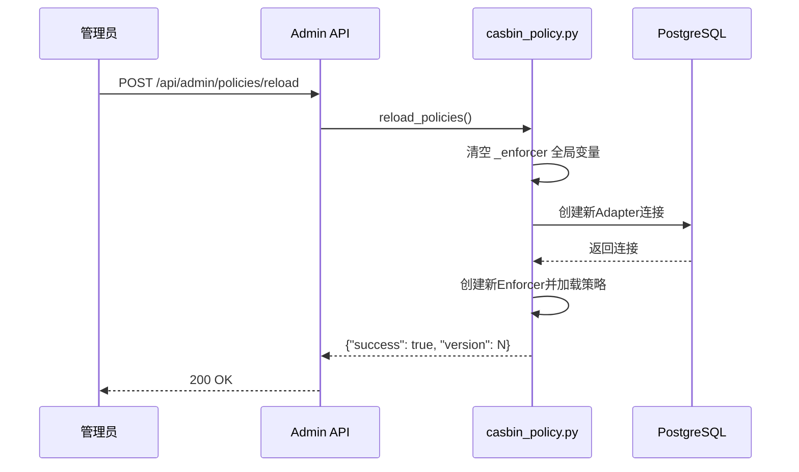

# FR-PERM-003: 动态策略热更新设计文档

## 1. 需求概述

### 1.1 需求来源
- **需求ID**: FR-PERM-003
- **描述**: Casbin策略更改后立即生效，无需重启服务
- **来源**: PRD用户故事#23
- **KANO类别**: 期望型
- **优先级**: P2

### 1.2 业务背景
当前系统部署模式为单体应用，策略更新需要重启服务，会造成业务中断。未来可能升级到集群部署。

### 1.3 成功标准
- 策略更新后5秒内生效
- 零停机部署支持
- 不影响现有权限校验性能

---

## 2. 架构设计

### 2.1 整体架构

```mermaid
graph TD
    subgraph 权限策略热更新架构
        AdminAPI[Admin API\nPOST /api/admin/policies/reload]
        PolicyAPI[策略重载接口\nreload_policies()]
        Enforcer[Casbin Enforcer]
        Database[(PostgreSQL\n策略存储)]
        
        AdminAPI --> PolicyAPI
        PolicyAPI --> Enforcer
        Enforcer --> Database
    end
```

### 2.2 核心设计思路

| 设计要点 | 实现方式 |
|----------|----------|
| **缓存机制** | 移除 `@lru_cache`，改用全局变量存储enforcer实例 |
| **策略重载** | 提供显式的 `reload_policies()` 函数 |
| **版本追踪** | 新增策略版本号，便于追踪更新 |
| **API接口** | 新增管理员重载端点 |

---

## 3. 详细设计

### 3.1 核心代码改动

**文件**: `app/core/casbin_policy.py`

**改动说明**:

| 改动点 | 原实现 | 新实现 |
|--------|--------|--------|
| Enforcer缓存 | `@lru_cache()` 装饰器 | 全局变量 `_enforcer` + `_policy_version` |
| 策略重载 | 不支持 | 新增 `reload_policies()` 函数 |
| 版本追踪 | 无 | 新增 `_policy_version` 全局变量 |

**代码结构**:

```python
# 全局变量
_enforcer = None
_policy_version = 0

def get_enforcer(refresh: bool = False) -> casbin.Enforcer:
    """获取Enforcer实例，支持刷新"""
    global _enforcer, _policy_version
    
    if refresh or _enforcer is None:
        adapter = casbin_sqlalchemy_adapter.Adapter(settings.DATABASE_URL)
        model = casbin.model.Model()
        model.load_model_from_text(RBAC_MODEL)
        _enforcer = casbin.Enforcer(model, adapter)
        _policy_version += 1
    
    return _enforcer

async def reload_policies() -> dict:
    """重新加载策略"""
    global _enforcer
    _enforcer = None  # 清空缓存
    get_enforcer(refresh=True)
    
    return {
        "success": True,
        "message": "Policies reloaded successfully",
        "version": _policy_version
    }
```

### 3.2 API接口设计

**新增端点**: `POST /api/admin/policies/reload`

| 属性 | 值 |
|------|------|
| **路径** | `/api/admin/policies/reload` |
| **方法** | POST |
| **权限** | 需要管理员角色 |
| **所属文件** | `app/api/admin.py` |

**请求体**:

| 参数 | 类型 | 必填 | 说明 |
|------|------|------|------|
| `force` | boolean | 否 | 是否强制重载（默认true） |

**成功响应** (200):

```json
{
  "success": true,
  "message": "Policies reloaded successfully",
  "version": 1
}
```

**失败响应** (403):

```json
{
  "success": false,
  "message": "Permission denied",
  "version": 0
}
```

### 3.3 数据流



### 3.4 数据库影响

**无数据库schema变更**。策略仍存储在现有的Casbin策略表中。

---

## 4. 安全性考虑

### 4.1 权限控制

| 控制项 | 说明 |
|--------|------|
| **API访问权限** | 仅管理员角色可调用重载接口 |
| **策略验证** | 重载前验证策略格式合法性 |
| **审计日志** | 记录策略重载操作 |

### 4.2 异常处理

| 异常场景 | 处理方式 |
|----------|----------|
| 数据库连接失败 | 返回错误响应，保留旧策略 |
| 策略格式错误 | 返回错误响应，保留旧策略 |
| 并发重载请求 | 使用锁机制保证原子性 |

---

## 5. 测试方案

### 5.1 单元测试

| 测试场景 | 预期结果 | 测试方法 |
|----------|----------|----------|
| 初始策略加载 | 管理员有wiki读写权限 | 调用 `check_permission()` |
| 添加新策略后重载 | 新策略立即生效 | 添加策略→调用`reload_policies()`→验证权限 |
| 删除策略后重载 | 策略立即失效 | 删除策略→调用`reload_policies()`→验证权限 |
| 重载后性能 | 响应时间<100ms | 性能测试 |

### 5.2 集成测试

| 测试场景 | 预期结果 |
|----------|----------|
| API调用权限控制 | 非管理员调用返回403 |
| 重载成功响应 | 返回版本号递增 |
| 重载失败处理 | 数据库断开时返回错误，旧策略仍生效 |

---

## 6. 部署与集成

### 6.1 依赖检查

| 依赖 | 版本要求 | 说明 |
|------|----------|------|
| casbin | >=1.28.0 | 策略重载支持 |
| casbin-sqlalchemy-adapter | >=2.0.0 | SQLAlchemy 2.0支持 |

### 6.2 部署注意事项

- **单体部署**: 直接部署，无需额外配置
- **集群部署**（未来扩展）: 需要额外实现Redis发布/订阅机制

---

## 7. 向后兼容性

- **完全向后兼容**: 不影响现有API和业务逻辑
- **策略格式兼容**: 保持原有Casbin策略格式

---

## 8. 总结

| 评估项 | 说明 |
|--------|------|
| **实现复杂度** | 低 |
| **风险等级** | 低 |
| **预期收益** | 策略更新零停机 |
| **未来扩展性** | 可扩展支持集群部署 |

---

**文档版本**: v1.0  
**创建日期**: 2026-05-25  
**状态**: 设计完成